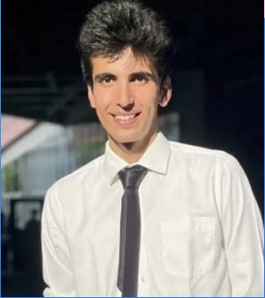
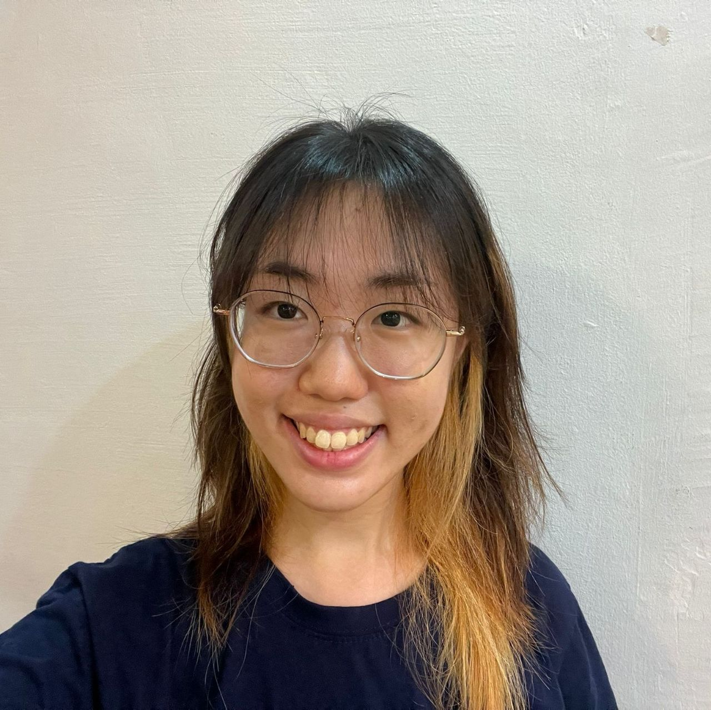

We are a team based in the [School of Computing, National University of Singapore](http://www.comp.nus.edu.sg).

You can reach us at the email `seer[at]u.nus.edu`

## Project team

### John Doe

[[homepage](http://www.comp.nus.edu.sg/~damithch)]
[[github](https://github.com/johndoe)]
[[portfolio](team/johndoe.md)]

* Role: Project Advisor

### Tejas Gandhi

[[github](http://github.com/newway1814)]
[[portfolio](team/newway1814.md)]

* Role: Team Lead
* Responsibilities:

### Guo Jiaqi Jackie

[[github](http://github.com/guojiaqijackie)] [[portfolio](team/guojiaqijackie.md)]

* Role: Developer
* Responsibilities: Data

### Jean Doe

[[github](http://github.com/johndoe)]
[[portfolio](team/johndoe.md)]

* Role: Developer
* Responsibilities: Dev Ops + Threading

### Yarn Meng

[[github](http://github.com/yarnmengnus)]
[[portfolio](team/yarnmeng.md)]

* Role: Developer
* Responsibilities: 
