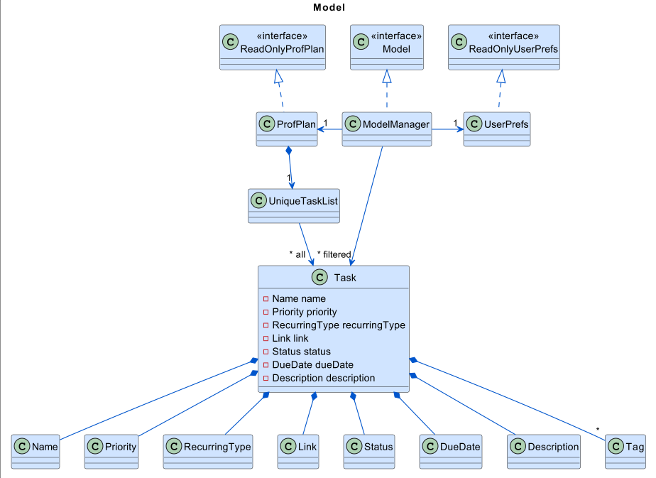
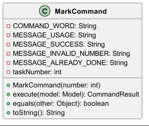
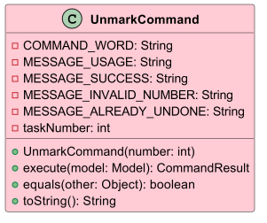
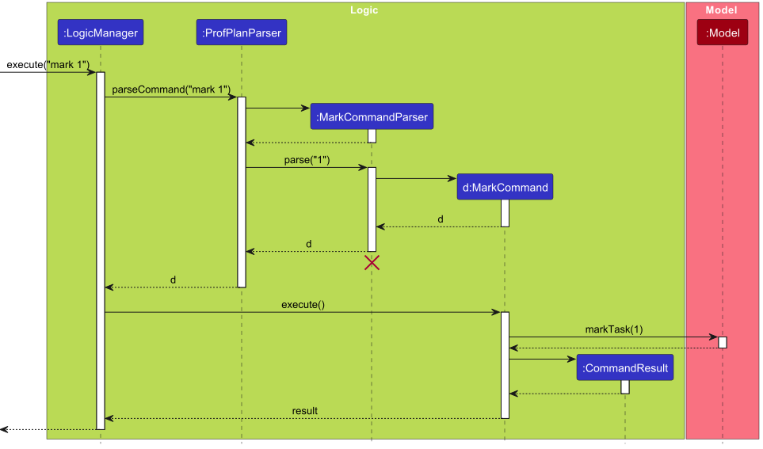
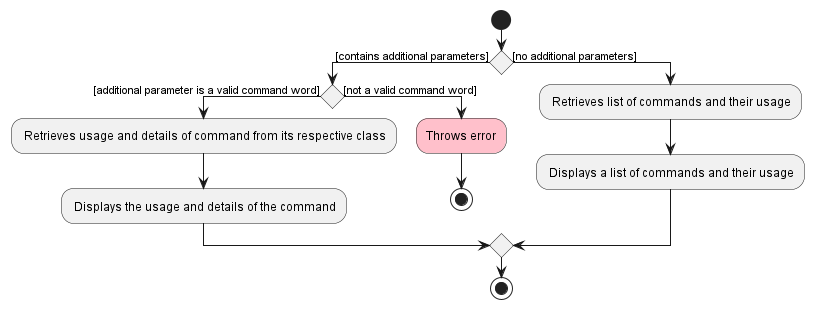
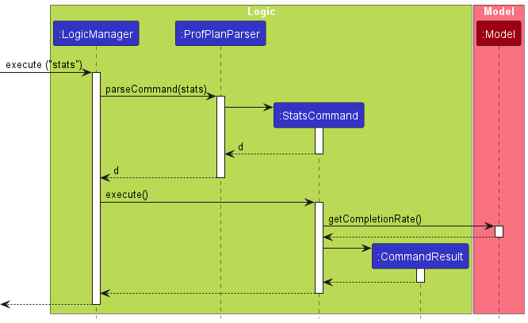
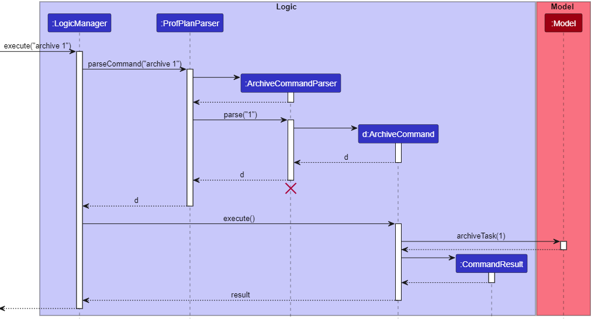
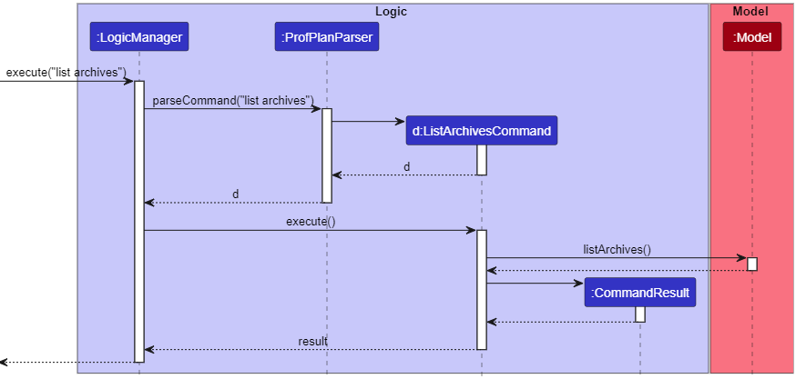

* Table of Contents
{:toc}

--------------------------------------------------------------------------------------------------------------------

## **Acknowledgements**

* This project is built on top of the codebase of [AddressBook Level-3 (AB3)](https://github.com/se-edu/addressbook-level3).

--------------------------------------------------------------------------------------------------------------------

## **Setting up, getting started**

Refer to the guide [_Setting up and getting started_](SettingUp.md).

--------------------------------------------------------------------------------------------------------------------

## **Design**

:bulb: **Tip:** The `.puml` files used to create diagrams in this document `docs/diagrams` folder. Refer to the [_PlantUML Tutorial_ at se-edu/guides](https://se-education.org/guides/tutorials/plantUml.html) to learn how to create and edit diagrams.

### Architecture

The ***Architecture Diagram*** given above explains the high-level design of the App.

Given below is a quick overview of main components and how they interact with each other.

**Main components of the architecture**

**`Main`** (consisting of classes [`Main`](https://github.com/AY2324S1-CS2103T-W15-1/tp/blob/master/src/main/java/profplan/Main.java) and [`MainApp`](https://github.com/AY2324S1-CS2103T-W15-1/tp/blob/master/src/main/java/profplan/MainApp.java)) is in charge of the app launch and shut down.
* At app launch, it initializes the other components in the correct sequence, and connects them up with each other.
* At shut down, it shuts down the other components and invokes cleanup methods where necessary.

The bulk of the app's work is done by the following four components:

* [**`UI`**](#ui-component): The UI of the App.
* [**`Logic`**](#logic-component): The command executor.
* [**`Model`**](#model-component): Holds the data of the App in memory.
* [**`Storage`**](#storage-component): Reads data from, and writes data to, the hard disk.

[**`Commons`**](#common-classes) represents a collection of classes used by multiple other components.

**How the architecture components interact with each other**

The *Sequence Diagram* below shows how the components interact with each other for the scenario where the user issues the command `delete 1`.

Each of the four main components (also shown in the diagram above),

* defines its *API* in an `interface` with the same name as the Component.
* implements its functionality using a concrete `{Component Name}Manager` class (which follows the corresponding API `interface` mentioned in the previous point).

For example, the `Logic` component defines its API in the `Logic.java` interface and implements its functionality using the `LogicManager.java` class which follows the `Logic` interface. Other components interact with a given component through its interface rather than the concrete class (reason: to prevent outside component's being coupled to the implementation of a component), as illustrated in the (partial) class diagram below.

The sections below give more details of each component.

### UI component

The **API** of this component is specified in [`Ui.java`](https://github.com/AY2324S1-CS2103T-W15-1/tp/blob/master/src/main/java/profplan/ui/Ui.java)

The UI consists of a `MainWindow` that is made up of parts e.g.`CommandBox`, `ResultDisplay`, `TaskListPanel`, `StatusBarFooter` etc. All these, including the `MainWindow`, inherit from the abstract `UiPart` class which captures the commonalities between classes that represent parts of the visible GUI.

The `UI` component uses the JavaFx UI framework. The layout of these UI parts are defined in matching `.fxml` files that are in the `src/main/resources/view` folder. For example, the layout of the [`MainWindow`](https://github.com/AY2324S1-CS2103T-W15-1/tp/blob/master/src/main/java/profplan/ui/MainWindow.java) is specified in [`MainWindow.fxml`](https://github.com/AY2324S1-CS2103T-W15-1/tp/tree/master/src/main/resources/view/MainWindow.fxml)

The `UI` component,

* executes user commands using the `Logic` component.
* listens for changes to `Model` data so that the UI can be updated with the modified data.
* keeps a reference to the `Logic` component, because the `UI` relies on the `Logic` to execute commands.
* depends on some classes in the `Model` component, as it displays `Task` object residing in the `Model`.

### Logic component

**API** : [`Logic.java`](https://github.com/AY2324S1-CS2103T-W15-1/tp/blob/master/src/main/java/profplan/logic/Logic.java)

Here's a (partial) class diagram of the `Logic` component:

 
The sequence diagram below illustrates the interactions within the `Logic` component, taking `execute("delete 1")` API call as an example.

:information_source: **Note:** The lifeline for `DeleteCommandParser` should end at the destroy marker (X) but due to a limitation of PlantUML, the lifeline reaches the end of diagram.

 
How the `Logic` component works:

1. When `Logic` is called upon to execute a command, it is passed to an `ProfPlanParser` object which in turn creates a parser that matches the command (e.g., `DeleteCommandParser`) and uses it to parse the command.
1. This results in a `Command` object (more precisely, an object of one of its subclasses e.g., `DeleteCommand`) which is executed by the `LogicManager`.
1. The command can communicate with the `Model` when it is executed (e.g. to delete a task).
1. The result of the command execution is encapsulated as a `CommandResult` object which is returned back from `Logic`.

Here are the other classes in `Logic` (omitted from the class diagram above) that are used for parsing a user command:

How the parsing works:
* When called upon to parse a user command, the `ProfPlanParser` class creates an `XYZCommandParser` (`XYZ` is a placeholder for the specific command name e.g., `AddCommandParser`) which uses the other classes shown above to parse the user command and create a `XYZCommand` object (e.g., `AddCommand`) which the `ProfPlanParser` returns back as a `Command` object.
* All `XYZCommandParser` classes (e.g., `AddCommandParser`, `DeleteCommandParser`, ...) inherit from the `Parser` interface so that they can be treated similarly where possible e.g, during testing.

### Model component
**API** : [`Model.java`](https://github.com/AY2324S1-CS2103T-W15-1/tp/blob/master/src/main/java/profplan/model/Model.java)

The `Model` component,

* stores the task list data i.e., all `Task` objects (which are contained in a `UniqueTaskList` object).
* stores the currently 'selected' `Task` objects (e.g., results of a search query) as a separate _filtered_ list which is exposed to outsiders as an unmodifiable `ObservableList<Task>` that can be 'observed' e.g. the UI can be bound to this list so that the UI automatically updates when the data in the list change.
* stores a `UserPref` object that represents the user’s preferences. This is exposed to the outside as a `ReadOnlyUserPref` objects.
* does not depend on any of the other three components (as the `Model` represents data entities of the domain, they should make sense on their own without depending on other components)

:information_source: **Note:** An alternative (arguably, a more OOP) model is given below. It has a `Tag` list in the `ProfPlan`, which `Task` references. This allows `ProfPlan` to only require one `Tag` object per unique tag, instead of each `Task` needing their own `Tag` objects. 
 

### Storage component

**API** : [`Storage.java`](https://github.com/AY2324S1-CS2103T-W15-1/tp/blob/master/src/main/java/profplan/storage/Storage.java)

The `Storage` component,
* can save both tasklist data and user preference data in JSON format, and read them back into corresponding objects.
* inherits from both `ProfPlanStorage` and `UserPrefsStorage`, which means it can be treated as either one (if only the functionality of only one is needed).
* depends on some classes in the `Model` component (because the `Storage` component's job is to save/retrieve objects that belong to the `Model`)

### Common classes

Classes used by multiple components are in the `profplan.commons` package.

--------------------------------------------------------------------------------------------------------------------

## **Implementation**

This section describes some noteworthy details on how certain features are implemented.

## DoNext feature
### Actual implementation
- The DoNext feature in ProfPlan allows users to generate a recommendation of which task to do next.
- We compute (priority) / (number of days to due date) for every task, and select the task with the highest computed value as the recommendation.
- This is because a task is recommended if it has higher priority and lower number of days left to due date.
- Below, we describe the implementation details for this feature through a (partial) UML class and state diagram:

[//]: # (
)

[//]: # (    
)

[//]: # (        )

[//]: # (    
)

[//]: # (
)

The `DoNextCommand` is a part of the ProfPlan application, a task management tool. It allows users to generate next task recommendation. It is one of the standout features of ProfPlan, as it generates smart recommendations for professors.

### Code Structure
The code structure for the `DoNextCommand` is well-organized. It consists of the following components:
- `DoNextCommand` class: Represents the command itself.
- `ProfPlanParser` class: Responsible for parsing user input and creating `DoNextCommand` instances.
- `Priority` class: Represents the priority of a task (from 1 to 10).
- `DueDate` class: Represents the deadline of a task (in dd-MM-yyyy format, e.g. '01-02-2023').
- `Task` class: Represents a task, and it contains the priority and dueDate that `DoNextCommand` processes.
- `ModelManager` class: contains the `getDoNextTask()` function to generate recommended task.

### Class Details 
### `DoNextCommand` 
- Purpose: Represents the `do_next` command that generates next task recommendation.
- Key Methods:
    - `execute(Model model)`: Executes the `DoNextCommand` by computing and output the next task to do.

### `Priority` 
- Purpose: Represents the priority of a task (from 1 to 10).
- Key Methods:
    - `isValidPriority(String test)`: Checks if a given priority is valid according to the predefined regex.

### `DueDate` 
- Purpose: Represents the deadline of a task (in dd-MM-yyyy format or '01-02-2023').
- Key Methods:
    - `isValidDate(String test)`: Checks if a given date is valid according to the predefined regex.
    - `isIncludedorBefore(DueDate otherDate)`: Checks whether the current date is before, on equals the given date.

### `Task` 
- Purpose: Represents a task, and it contains the priority and dueDate.
- Key Methods:
    - `getPriority()`: returns the priority of the task.
    - `getDueDate()`: returns the dueDate of the task.

### `ModelManager` 
- Purpose: Represents a model manager, implements the Model class and carries out core functionality for commands.
- Key Methods:
    - `getDoNextTask()`: returns the recommended task after processing priority/#daysTodueDate for every task.

### Sequence Diagram 
The sequence diagram provides an overview of how the `DoNext` is executed and interacts with other components.

[//]: # ()
[//]: # (![Sequence Diagram]&#40;images/DoNextCommandSequenceDiagram.png&#41;)

Here's a breakdown of the sequence:
1. The `LogicManager` receives the command "do_next" from the user.
2. The `ProfPlanParser` parses the command and creates a `DoNextCommand`.
4. The `DoNextCommand` is executed.
5. The `ModelManager` executes the function `getDoNextTask`
6. A `CommandResult` is created to provide feedback to the user, containing the recommended task as a String.
7. The result is returned to the `LogicManager`.

### Usage 
To use the `DoNext` in the ProfPlan application, you can execute the following steps:

1. Enter the "do_next" command.

2. The `DoNext` will handle the task recommendation generation.

3. The application will provide feedback, and output the task generated in the message window.

## Mark/Unmark feature
### Actual implementation
The Mark/Unmark feature in ProfPlan allows users to set a task as done or undone respectively. Below, we describe the implementation details for this feature through a (partial) UML class diagram:

    

        
    

    

        
    

The `MarkCommand` is a part of the ProfPlan application, a task management tool. The `MarkCommand` allows users to mark a task as done by specifying the task index. It is a critical part of the application's functionality, as it helps users manage and track their tasks efficiently.

### Code Structure
The code structure for the `MarkCommand` is well-organized. It consists of the following components:
- `MarkCommand` class: Represents the command itself.
- `MarkCommandParser` class: Responsible for parsing user input and creating `MarkCommand` instances.
- `Status` class: Represents the status of a task (either "done" or "undone").
- `Task` class: Represents a task, and it contains the status that the `MarkCommand` changes.

### Class Details 
### `MarkCommand` 
- Purpose: Represents the `mark` command that allows users to mark a task as done.
- Key Methods:
    - `execute(Model model)`: Executes the `MarkCommand` by marking the task as done in the model.
    - `equals(Object other)`: Compares two `MarkCommand` objects for equality.
    - `toString()`: Returns a string representation of the `MarkCommand`.

### `MarkCommandParser` 
- Purpose: Parses user input to create `MarkCommand` instances.
- Key Methods:
    - `parse(String args)`: Parses the user input and returns a `MarkCommand` if the input is valid.

### `Status` 
- Purpose: Represents the status of a task. It can be either "done" or "undone."
- Key Methods:
    - `isValidStatus(String test)`: Checks if a given status is valid according to the predefined regex.

### `Task` 
- Purpose: Represents a task, and it contains the status that the `MarkCommand` changes.
- Key Methods:
    - `setStatus(Status status)`: Sets the status of the task.
    - `Task(Task task)`: Constructor for creating a new task as a copy of an existing task.

### Sequence Diagram 
The sequence diagram below provides an overview of how the `MarkCommand` is executed and interacts with other components.

Here's a breakdown of the sequence:
1. The `LogicManager` receives the command "mark 1" from the user.
2. The `ProfPlanParser` parses the command and recognizes it as a `MarkCommand`.
3. The `MarkCommandParser` parses the argument "1" and creates a `MarkCommand`.
4. The `MarkCommand` is executed.
5. The `Model` is updated by marking the task as done.
6. A `CommandResult` is created to provide feedback to the user.
7. The result is returned to the `LogicManager`.

### Usage 
To use the `MarkCommand` in the ProfPlan application, you can execute the following steps:

1. Enter the "mark" command followed by the task index you want to mark as done. For example, "mark 1" marks the task with index 1 as done.

2. The `MarkCommand` will handle the task marking process and update the task status in the model.

3. The application will provide feedback, indicating the successful marking of the task as done.

## Filter feature
### Actual implementation
The Filter feature in ProfPlan allows users to filter according to one or more of the following criteria:
- `DueDate`: displays tasks before given due date
- `Priority`: displays tasks of given priority
- `Status`: displays tasks of given status
- `RecurringType`: displays tasks of given recurring type

Below, we describe the implementation details for this feature through a (partial )UML class diagram:

    

        
    

The `FilterCommand` is a part of the ProfPlan application, a task management tool. The `FilterCommand` allows users to filter tasks by due date, priority, and status. This enables clearer visualisation of tasks.

### Code Structure
The code structure for the `FilterCommand` is well-organized. It consists of the following components:
- `FilterCommand` class: Represents the command itself.
- `FilterCommandParser` class: Responsible for parsing user input and creating `FilterCommand` instances.
- `TaskDueDatePredicate` class: Represents the DueDate predicate.
- `TaskPriorityPredicate` class: Represents the Priority predicate.
- `TaskStatusPredicate` class: Represents the Status predicate.
- `TaskRecurringTypePredicate` class: Represents the RecurringType predicate
- `CombinedPredicate` class: Represents the combination of multiple predicates

### Class Details 
### `FilterCommand` 
- Purpose: Represents the `filter` command that allows users to filter by DueDate, Priority, Status, and/or RecurringType.
- Key Methods:
    - `execute(Model model)`: Executes the `FilterCommand` by updating the filtered task list in model.
    - `equals(Object other)`: Compares two `FilterCommand` objects for equality.
    - `toString()`: Returns a string representation of the `FilterCommand`.

### `FilterCommandParser` 
- Purpose: Parses user input to create `FilterCommand` instances.
- Key Methods:
    - `parse(String args)`: Parses the user input using the `ArgumentMultimap` and returns a `FilterCommand` if the input is valid.

### `TaskDueDatePredicate` 
- Purpose: Represents the DueDate predicate. It contains a `DueDate`, whose value is determined by the user input.
- Key Methods:
    - `getDueDate()`: Returns the `DueDate` predicate.
    - `test(Task task)`: Returns true if a given Task falls before or on the `DueDate`.
    - `equals(Object other)`: Compares two `TaskDueDatePredicate` objects for equality.
    - `toString()`: Returns a string representation of the `TaskDueDatePredicate`.

### `TaskPriorityPredicate` 
- Purpose: Represents the Priority predicate. It contains a `Priority`, whose value is determined by the user input.
- Key Methods:
    - `getPriority()`: Returns the `Priority` predicate.
    - `test(Task task)`: Returns true if given Task has the same `Priority` as the predicate.
    - `equals(Object other)`: Compares two `TaskPriorityPredicate` objects for equality.
    - `toString()`: Returns a string representation of the `TaskPriorityPredicate`.

### `TaskStatusPredicate` 
- Purpose: Represents the Status predicate. It contains a `Status`, whose value is determined by the user input.
- Key Methods:
    - `getStatus()`: Returns the `Status` predicate.
    - `test(Task task)`: Returns true if given Task has the same `Status` as the predicate.
    - `equals(Object other)`: Compares two `TaskStatusPredicate` objects for equality.
    - `toString()`: Returns a string representation of the `TaskStatusPredicate`.

### `TaskRecurringTypePredicate` 
- Purpose: Represents the RecurringType predicate. It contains a `RecurringType`, whose value is determined by the user input.
- Key Methods:
    - `getRecurringType()`: Returns the `RecurringType` predicate.
    - `test(Task task)`: Returns true if given Task has the same `RecurringType` as the predicate.
    - `equals(Object other)`: Compares two `TaskRecurringTypePredicate` objects for equality.
    - `toString()`: Returns a string representation of the `TaskRecurringTypePredicate`.

### `CombinedPredicate` 
- Purpose: Represents the combination of multiple predicates. It contains an `ArrayList<Predicate<Task>>`, which contains the predicates it considers.
- Key Methods:
    - `test(Task task)`: Returns true if given Task fulfills all the predicates in the ArrayList of predicates.
    - `equals(Object other)`: Compares two `CombinedPredicate` objects for equality.
    - `toString()`: Returns a string representation of the `CombinedPredicate`.

### Usage 
To use the `FilterCommand` in the ProfPlan application, you can execute the following steps:

1. Enter the "filter" command followed by "d/", "p/", "s/" and/or "recur/", for DueDate, Priority, Status and RecurringType respectively. Then, input the value of predicate, which must follow the formats of the criteria:
    - DueDate: a date in the format dd-MM-yyyy
    - Priority: an Integer from 1 to 10 inclusive
    - Status: "done" or "undone
    - RecurringType: "none", "daily", "weekly", "monthly", or "semesterly"
For example, "filter d/01-01-2023 s/undone" filters for tasks before and on 01-01-2023 that are undone.

2. The `FilterCommand` will filter the task list in the model according to the predicate(s) applied.

3. The application will provide feedback, indicating the successful filtering, and display the relevant tasks.

## Help for Commands feature

The detail listing mechanism is facilitated by the `HelpCommandParser` class, which implements the `Parser` interface. This `HelpCommandParser` overrides the `parse()` method in `Parser` and creates either an empty `HelpCommand`, or a `HelpCommand` with a `COMMAND_WORD` as a String. For example `help` or `help delete`.

Hence, this will be facilitated by overloading the constructor in `HelpCommand` to either create an empty `HelpCommand`, or a `HelpCommand` with a `COMMAND_WORD`:
* When an empty `HelpCommand` executes `execute()`, a `CommandResult` with `MESSAGE_USAGE` of all commands will be created.
* When a `HelpCommand` with a `COMMAND_WORD` executes `execute()`, a `CommandResult` with the `MESSAGE_DETAIL` of the `Command` specified by the `COMMAND_WORD` will be created.

The following activity diagram shows how the Help Command works:

### Design considerations:

**Aspect: How to store `Command` details:**

* **Alternative 1 (current choice): Store Command Details in each command.**

  * Pros: Follows OOP principles.

  * Cons: Changes will need to be propagated in Command Usage and Details format to all Commands individually.

* **Alternative 2: Store all Command Details in a separate class.**

  * Pros: Centralised area to view all Messages.

  * Cons: Does not follow OOP principles. Future implementations that tap on these Details will take longer to implement.

## Displaying statistics

The statistics mechanism requires support from `Model`, which will provide `StatsCommand` the required statistics. Currently, this is done using a public getter `getCompletionRate()`. 

When `StatsCommand` executes `execute()`, it calls this getter and returns a new `CommandResult` containing a formatted `String`, with the statistics retrieved.

The following sequence diagram shows how the stats command works:

Here's a breakdown of the sequence:
1. The `LogicManager` receives the command "stats" from the user.
1. The `ProfPlanParser` parses the command and creates a `StatsCommand`.
1. The `StatsCommand` is executed by `LogicManager`.
1. The getter, `getCompletionRate()`, is called on `Model`. 
1. `Model` returns a `double` containing the completion rate.
1. A `CommandResult` is created and formatted to provide feedback to the user.
1. The result is returned to the `LogicManager`.

### Design considerations:

**Aspect: How to retrieve statistics:**

* **Alternative 1 (current choice): Use a public getter in Model.**

  * Pros: Simple and readable.

  * Cons: Exposes more of Model, which may result in unintended use by developers.

* **Alternative 2: Retrieve a copy of the task list and calculate statistics as such.**

  * Pros: List is not mutated. All calculations of Statistics is centralised under StatsCommand.

  * Cons: Does not follow OOP principles. Operations regarding the list should be handled by the list.

## \[Proposed\] Undo/redo feature

### Proposed Implementation

The proposed undo/redo mechanism is facilitated by `VersionedProfPlan`. It extends `ProfPlan` with an undo/redo history, stored internally as an `profPlanStateList` and `currentStatePointer`. Additionally, it implements the following operations:

* `VersionedProfPlan#commit()` — Saves the current tasklist state in its history.
* `VersionedProfPlan#undo()` — Restores the previous tasklist state from its history.
* `VersionedProfPlan#redo()` — Restores a previously undone tasklist state from its history.

These operations are exposed in the `Model` interface as `Model#commitProfPlan()`, `Model#undoProfPlan()` and `Model#redoProfPlan()` respectively.

Given below is an example usage scenario and how the undo/redo mechanism behaves at each step.

Step 1. The user launches the application for the first time. The `VersionedProfPlan` will be initialized with the initial task list state, and the `currentStatePointer` pointing to that single task list state.

Step 2. The user executes `delete 5` command to delete the 5th task in the tasklist. The `delete` command calls `Model#commitProfPlan()`, causing the modified state of the task list after the `delete 5` command executes to be saved in the `profPlanStateList`, and the `currentStatePointer` is shifted to the newly inserted tasklist state.

Step 3. The user executes `add n/Grade assignment …​` to add a new task. The `add` command also calls `Model#commitProfPlan()`, causing another modified tasklist state to be saved into the `ProfPlanStateList`.

:information_source: **Note:** If a command fails its execution, it will not call `Model#commitProfPlan()`, so the tasklist state will not be saved into the `profPlanStateList`.

Step 4. The user now decides that adding the task was a mistake, and decides to undo that action by executing the `undo` command. The `undo` command will call `Model#undoProfPlan()`, which will shift the `currentStatePointer` once to the left, pointing it to the previous tasklist state, and restores the tasklist to that state.

:information_source: **Note:** If the `currentStatePointer` is at index 0, pointing to the initial ProfPlan state, then there are no previous ProfPlan states to restore. The `undo` command uses `Model#canUndoProfPlan()` to check if this is the case. If so, it will return an error to the user rather than attempting to perform the undo.

The following sequence diagram shows how the undo operation works:

:information_source: **Note:** The lifeline for `UndoCommand` should end at the destroy marker (X) but due to a limitation of PlantUML, the lifeline reaches the end of diagram.

The `redo` command does the opposite — it calls `Model#redoProfPlan()`, which shifts the `currentStatePointer` once to the right, pointing to the previously undone state, and restores the tasklist to that state.

:information_source: **Note:** If the `currentStatePointer` is at index `profPlanStateList.size() - 1`, pointing to the latest tasklist state, then there are no undone ProfPlan states to restore. The `redo` command uses `Model#canRedoProfPlan()` to check if this is the case. If so, it will return an error to the user rather than attempting to perform the redo.

Step 5. The user then decides to execute the command `list`. Commands that do not modify the tasklist, such as `list`, will usually not call `Model#commitProfPlan()`, `Model#undoProfPlan()` or `Model#redoProfPlan()`. Thus, the `profPlanStateList` remains unchanged.

Step 6. The user executes `clear`, which calls `Model#commitProfPlan()`. Since the `currentStatePointer` is not pointing at the end of the `profPlanStateList`, all tasklist states after the `currentStatePointer` will be purged. Reason: It no longer makes sense to redo the `add n/Grade assignment …​` command. This is the behavior that most modern desktop applications follow.

The following activity diagram summarizes what happens when a user executes a new command:

### Design considerations:

**Aspect: How undo & redo executes:**

* **Alternative 1 (current choice):** Saves the entire tasklist.
  * Pros: Easy to implement.
  * Cons: May have performance issues in terms of memory usage.

* **Alternative 2:** Individual command knows how to undo/redo by
  itself.
  * Pros: Will use less memory (e.g. for `delete`, just save the task being deleted).
  * Cons: We must ensure that the implementation of each individual command are correct.

## \[Proposed\] Task Archiving feature

### Proposed Implementation

The proposed task archiving function makes use of the `ArchivedProfPlan` class. It extends `ProfPlan`, storing a separate list of tasks that are archived.

In addition, the `ModelManager`, which implements `Model`, has to include `ArchivedProfPlan`, in addition to `ProfPlan`, as one of its fields. 

#### 1. Archiving tasks

This is supported by the `ArchiveCommand` that extends `Command`, and implements this main operation:

* `ArchiveCommand#execute(Model model)` — Archives the selected task, i.e. deleting it from ProfPlan and adding it to ArchivedProfPlan.

This operation invodes a method in the `Model` interface, namely `Model#archiveTask(Task target)`.

To parse the Archive Command, there is the `ArchiveCommandParser` that implements `Parser`, which supports this main operation:

* `ArchiveCommandParser#parse(String args)` — Parses the user input to return an `ArchiveCommand`.
  * Valid arguments: Integers (task index), or "all"

The sequence diagram below shows how archiving a task works.

#### 2. List archived tasks

This is supported by the `ListArchivesCommand` that extends `Command`, and implements this main operation:

* `ListArchivesCommand#execute(Model model)` — Displays all archived tasks.

This operation invodes a method in the `Model` interface, namely `Model#getArchivedTasks()`. 

The sequence diagram below shows how displaying archived tasks works.

#### 3. Delete archived tasks

This uses similar implementation as the delete function on ProfPlan, but acting on ArchivedProfPlan instead.

It is supported by the `DeleteArchiveCommand` that extends `Command`, and implements this main operation:

* `DeleteArchiveCommand#execute(Model model)` — Deletes the selected task from ArchivedProfPlan.

This operation invodes a method in the `Model` interface, namely `Model#deleteArchive(Task target)`.

To parse the DeleteArchive Command, there is the `DeleteArchiveCommandParser` that implements `Parser`, which supports this main operation:

* `DeleteArchiveCommandParser#parse(String args)` — Parses the user input to return an `DeleteArchiveCommand`.
  * Valid arguments: Integers (task index), or "all"

#### 4. Restore archived tasks

This uses similar implementation as the archive function, but reversing ProfPlan and ArchivedProfPlan.

It is supported by the `RestoreArchiveCommand` that extends `Command`, and implements this main operation:

* `RestoreArchiveCommand#execute(Model model)` — Restores the selected archived task, i.e. deleting it from ArchivedProfPlan and adding it to ProfPlan.

This operation invodes a method in the `Model` interface, namely `Model#restoreArchiveTask(Task target)`.

To parse the Archive Command, there is the `RestoreArchiveCommandParser` that implements `Parser`, which supports this main operation:

* `RestoreArchiveCommandParser#parse(String args)` — Parses the user input to return an `RestoreArchiveCommand`.
  * Valid arguments: Integers (task index), or "all"

### Design considerations:

**Aspect: How to store archived tasks:**

* **Alternative 1 (current choice):** Saves archived tasks in a separate tasklist from the main ProfPlan, named ArchivedProfPlan.
  * Pros:
    * Better performance if many tasks are archived, and methods invoked on ProfPlan will not affect tasks in ArchivedProfPlan.
    * Clear segregation between archived and normal tasks.
  * Cons: Harder to implement.

* **Alternative 2:** Each task have an archive flag, which indicates whether they are archived. Archived tasks are not shown in the main ProfPlan.
  * Pros: Easier to implement as it is similar to tagging tasks.
  * Cons: Performance issues in the main ProfPlan if many tasks are archived.

--------------------------------------------------------------------------------------------------------------------

## **Documentation, logging, testing, configuration, dev-ops**

* [Documentation guide](Documentation.md)
* [Testing guide](Testing.md)
* [Logging guide](Logging.md)
* [Configuration guide](Configuration.md)
* [DevOps guide](DevOps.md)

--------------------------------------------------------------------------------------------------------------------

## **Appendix: Requirements**

### Product scope

**Target user profile**:

* needs to manage a significant number of tasks
* prefer to organise and classify tasks
* want to visualise relationships between tasks
* prefer desktop apps over other types
* can type fast
* prefers typing to mouse interactions
* is reasonably comfortable using CLI apps

**Value proposition**: Professors often need to plan and organise their course modules, including lecture materials, and research. ProfPlan can help them create and manage their academic tasks seamlessly through the CLI, which is optimised and helps in faster task management. It is tailored to professors’ requirements and task categories, helping them prioritise.

### User stories

**Priorities:**
* High (must have) - `* * *`
* Medium (nice to have) - `* *`
* Low (unlikely to have) - `*`

| Priority | As a …    | I want to …                                                 | So that I can…                          |
|----------|-----------|-------------------------------------------------------------|-----------------------------------------|
| `* * *`  | professor | be able to create a new task                                | keep track of them in a list            |
| `* * *`  | professor | assign priorities to tasks in my list                       | gauge task urgency                      |
| `* * *`  | professor | categorise/tag my tasks                                     | segregate and classify tasks            |
| `* * *`  | professor | mark tasks as done/undone                                   | keep track of what has been completed   |
| `* * *`  | professor | delete tasks                                                | clear up clutter                        |
| `* *`    | professor | filter tasks by due date                                    | manage deadlines effectively            |
| `* *`    | professor | search for tasks                                            | find the task I want to work on quickly |
| `*`      | professor | attach reference materials (filepath) or links to each task | access reference material easily        |
| `*`      | professor | create subtasks within the task list                        | have better organisation                |

### Use cases

For all use cases below, the **System** is `ProfPlan` and the **Actor** is the `user`, unless specified otherwise.

**Use Case: Create a New Task**

**MSS**

1. User requests to create a new task with specified details.
2. ProfPlan validates the input format for the given fields.
3. ProfPlan creates the new task and adds it to the task list.
4. ProfPlan displays a confirmation message with the updated task list.

   Use case ends.

**Extensions**

* **2a.** User enters a field with invalid format.

    * **2a1.** ProfPlan displays an error message and provides guidance on the correct format.

      *Use case ends.*

* **3a.** ProfPlan encounters an internal error while creating the task.

    * **3a1.** ProfPlan displays an error message indicating the task creation failed.

      *Use case ends.*

**Use Case: Edit a Task**

**MSS**

1. User requests to edit a task.
2. ProfPlan validates the input format for the task number and the specified field(s).
3. ProfPlan assigns new value(s) to the specified field(s) of the task.
4. ProfPlan displays a confirmation message with the updated task.

   Use case ends.

**Extensions**

* 2a. User specifies a task number that is outside the list indices or provides an invalid input.

    * 2a1. ProfPlan displays an error message to indicate invalid input.

      Use case ends.

* 2b. User requests to edit a task when there are no tasks in the list.

    * 2b1. ProfPlan displays an error message to indicate that there are no tasks.

      Use case ends.

* 3a. ProfPlan encounters an internal error while updating new values.

    * 3a1. ProfPlan displays an error message to indicate edit task failed.

      Use case ends.

**Use case: Find a Task**

**MSS**

1. User requests to find tasks matching certain search term(s).
2. ProfPlan displays a list of tasks that contain the search term(s).

   Use case ends.

**Extensions**

* 2a. There are no tasks that match the search term(s).

  * 2a1. ProfPlan displays an empty list, and informs the user that the search failed to find matches.

  *Use case ends.*

**Use Case: Mark Task as Done/Undone**

*Preconditions: There is at least one task in the task list.*

**MSS**

1. User requests to list tasks.
2. ProfPlan shows a list of tasks.
3. User selects a task to mark as done or undone by specifying its number in the list.
4. ProfPlan updates the task's completion status accordingly.

   Use case ends.

**Extensions**

* 3a. User specifies a task number that is outside the list indices or provides an invalid input.

    * 3a1. ProfPlan displays an error message.

      Use case ends.

* 3b. User attempts to mark a task as done/undone when there are no tasks in the list.

    * 3b1. ProfPlan displays an error message.

      Use case ends.

**Use Case: Delete Task/Delete All Tasks**

*Preconditions: There is at least one task in the task list.*

**MSS**

1. User requests to list tasks.
2. ProfPlan shows a list of tasks.
3. User chooses to delete a specific task by specifying its number in the list or requests to delete all tasks.
4. ProfPlan performs the deletion as per the user's request.

   Use case ends.

**Extensions**

* 3a. User specifies a task number that is outside the list indices or provides an invalid input.

    * 3a1. ProfPlan displays an error message.

      Use case ends.

* 3b. User requests to delete a task when there are no tasks in the list.

    * 3b1. ProfPlan displays an error message.

      Use case ends.

**Use Case: Filter Tasks based on Due Date**

**MSS**

1. User requests to filter task based on due date.
2. ProfPlan validates the input format for the date.
3. ProfPlan performs the filter and display tasks that fall before and on the specified date.

   Use case ends.

**Extensions**

* 2a. User provides an invalid date input.

    * 2a1. ProfPlan displays an error message to indicate invalid input.

      Use case ends.

* 3a. User requests to filter tasks when there are no tasks in the list.

    * 3a1. ProfPlan displays an empty list.

      Use case ends.

* 3b. There are tasks in the list but no tasks before the specified date.

    * 3b1. ProfPlan displays an empty list.

      Use case ends.

**Use Case: Attaching a link to a Task**

*Preconditions: There is at least one task in the task list.*

**MSS**

1. User requests to list tasks.
2. ProfPlan shows a list of tasks.
3. User requests to attach a link to a task.
4. ProfPlan attaches the link as per the user's request.

* 3a. User specifies a task number that is outside the list indices or provides an invalid input.

    * 3a1. ProfPlan displays an error message.

      Use case ends.

* 3b. User requests to attach a link to a task when there are no tasks in the list.

    * 3b1. ProfPlan displays an error message.

      Use case ends.

* 3c. User requests to attach an invalid link to a task.

    * 3c1. ProfPlan displays an error message.

      Use case ends.

### Non-Functional Requirements
#### Performance

- **Response Time:** ProfPlan shall respond to user commands within 2 seconds under normal system load conditions. This response time includes task creation, task modification, and task retrieval operations.

- **Scalability:** The application should be able to handle a growing number of tasks and users efficiently. It should scale gracefully without significant performance degradation.

#### Reliability

- **Availability:** ProfPlan should be available for use 24/7, with planned maintenance windows communicated to users in advance. The application should have an uptime of at least 99.5%.

- **Error Handling:** The application should provide informative error messages to users when they input incorrect or invalid commands. It should gracefully handle errors and exceptions without crashing.

#### Security

- **Data Protection:** ProfPlan should ensure the security and confidentiality of user data. User passwords and sensitive information should be stored securely using industry-standard encryption techniques.

- **Authentication:** Users should be required to log in with a valid username and password to access their task lists. Unauthorized access to user data should be prevented.

#### Compatibility

- **Java Version:** ProfPlan should be compatible with Java JDK 11 or higher to ensure optimal performance and support for the latest features and security updates.

#### Usability

- **User-Friendly Interface:** The CLI interface should be intuitive and easy to use, with clear and concise prompts, error messages, and help documentation.

- **Accessibility:** The application should be designed to be accessible to users with disabilities, following best practices for accessibility standards.

*{More to be added}*

### Glossary

* **Mainstream OS**: Windows, Linux, Unix, OS-X

--------------------------------------------------------------------------------------------------------------------

## **Appendix: Instructions for manual testing**

Given below are instructions to test the app manually.

:information_source: **Note:** These instructions only provide a starting point for testers to work on;
testers are expected to do more *exploratory* testing.

### Launch and shutdown

1. Initial launch

   1. Download the jar file and copy into an empty folder

   1. Double-click the jar file Expected: Shows the GUI with a set of sample contacts. The window size may not be optimum.

1. Saving window preferences

   1. Resize the window to an optimum size. Move the window to a different location. Close the window.

   1. Re-launch the app by double-clicking the jar file. 
       Expected: The most recent window size and location is retained.

1. _{ more test cases …​ }_

### Deleting a task

1. Deleting a task while all tasks are being shown

   1. Prerequisites: List all tasks using the `list` command. Multiple tasks in the list.

   1. Test case: `delete 1` 
      Expected: First contact is deleted from the list. Details of the deleted contact shown in the status message. Timestamp in the status bar is updated.

   1. Test case: `delete 0` 
      Expected: No task is deleted. Error details shown in the status message. Status bar remains the same.

   1. Other incorrect delete commands to try: `delete`, `delete x`, `...` (where x is larger than the list size) 
      Expected: Similar to previous.

1. _{ more test cases …​ }_

### Saving data

1. Dealing with missing/corrupted data files

   1. _{explain how to simulate a missing/corrupted file, and the expected behavior}_

1. _{ more test cases …​ }_
