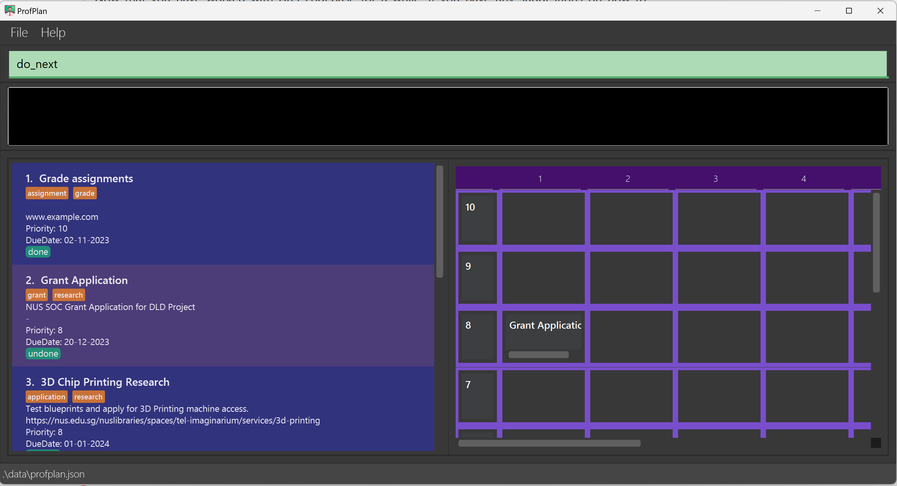
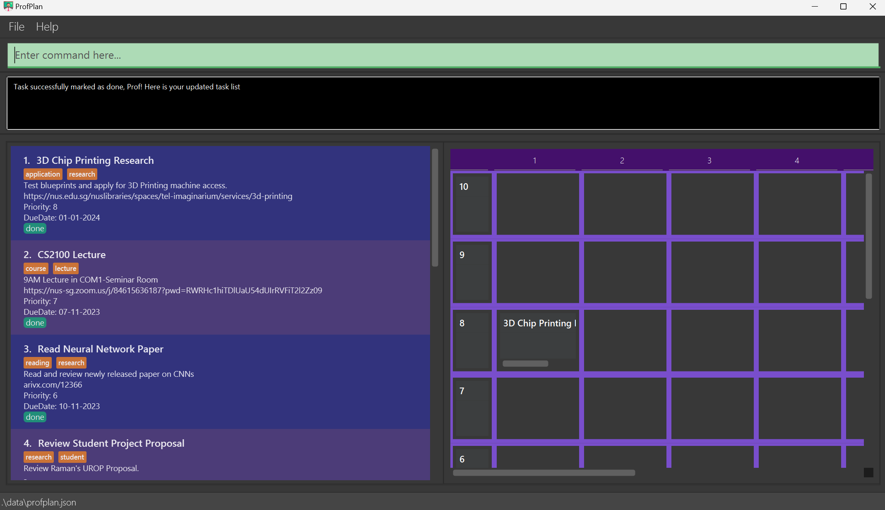
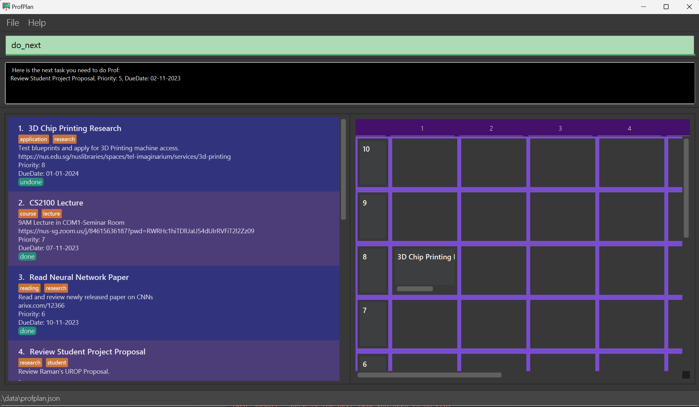
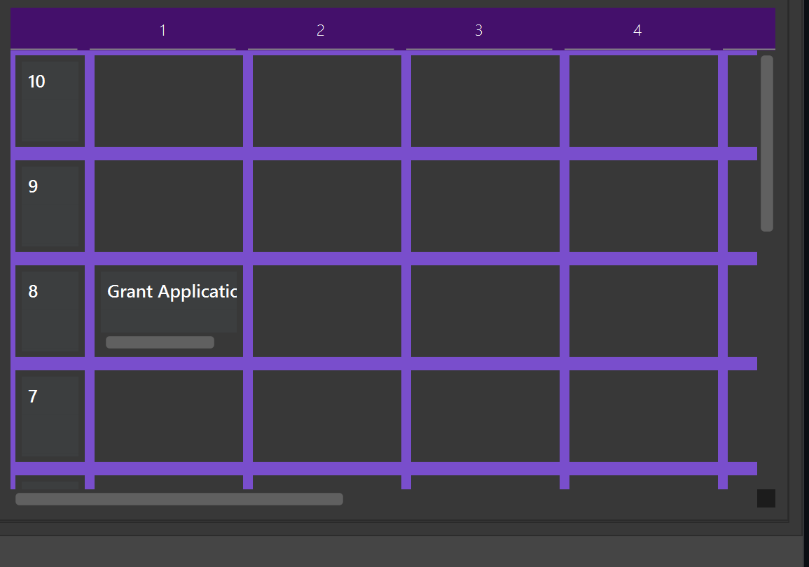
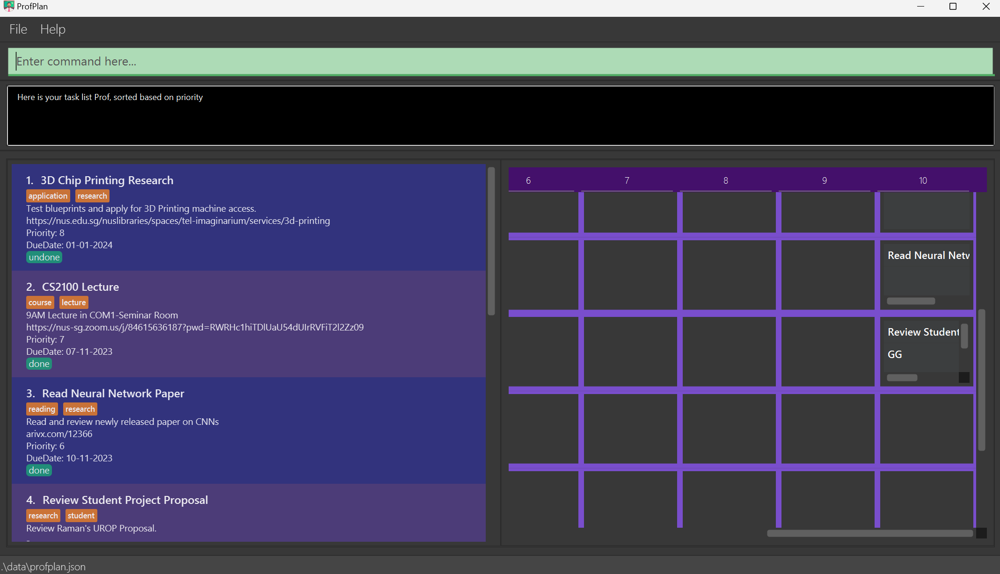

<style>
  .alert-primary{
      background-color: #d6e6ff;
      padding: 0.75rem 1.25rem;
      color: #073984;
      border-radius: 0.25rem;
      overflow-wrap: break-word;
  }

  .Warning{
      background-color: #fff3cd;
      padding: 0.75rem 1.25rem;
      color: #856404;
      border-radius: 0.25rem;
      overflow-wrap: break-word;
  }
  body{
      background-image:url("../tp/images/ProfPlanUserGuideBackground.png");
      background-repeat:repeat-y;
      background-size: "cover";
      background-position: center; 
      color:#EFEFEF;
      padding: 25px 50px;
      text-align: justify;
  }

  pre, code{
      color:#EFEFEF;
      background-color:#222224;
      border-color: #444;
  }
  .highlighter-rouge .highlight {
    background: #222224;
  }

  h1,h2,h3,h4,h5,h6{
      text-align: center;
      font-weight: 480;
  }

  th {
    background-color: #d8d8e3;
    color: #222;
  }
  table {
    color:#EFEFEF;
    background-color: #0C103D;
  }
  table tr:nth-child(even) {
    background-color: #111756;
}

  table tr:nth-child(even) {
    background-color: #3f3f3f;
  }
  .highlight {
    overflow-wrap: break-word;
    background: #242426;
  }
  a:hover {
    color: #69ebff;
  }
  #description {
    margin-top: 25px;
  }
  

</style>

<div style="display:none;" markdown="block">

</div>


# <center>User Guide - ProfPlan</center>

<div markdown = "block" style="page-break-after: always;" align="center">

</div>

## Overview

We believe that no Computer Science (CS) professor should have to wrestle and wrangle with redundant features and complicated interfaces. Built upon hours of research, ProfPlan offers a fast, efficient and seamless user experience for you to resolve your schedules in minimal time.

ProfPlan is a **desktop app for managing tasks, optimized for use via a Command Line Interface** (CLI) while still having the benefits of a Graphical User Interface (GUI). If you can type fast, ProfPlan can get your contact management tasks done faster than traditional GUI apps.
<br>



<div style="page-break-after: always;"></div>

## What It Does

ProfPlan can help you manage tasks seamlessly. Create, edit, delete tasks with ease. Our specialised tasks help you assign priorities, deadlines, status and much more to enhance your task management experience.

Our **<i>smart recommendation</i>** and **<i>visualisation</i>** features help you decide what to do next, and rank tasks based on several factors. You can also manage **<i>recurring tasks</i>** smoothly using ProfPlan’s recurring task functionality.

## Target Users

This product is specifically designed for **CS professors** who prefer **CLI** over GUI and have a **variety of tasks** such as module management (lecture, assessments, readings), research tracking (deadlines, publications, collaborations, papers), admin tasks (department, paperwork, meetings, budget) and so on.

## Team Behind ProfPlan


Contact us using this [Google Form](https://forms.gle/Dzb12Re4MYJxzf8w6) to connect with us, leave feedback, and more!

<div style="page-break-after: always;"></div>


## Contents

- [Overview](#overview)
- [A Task in ProfPlan](#a-task-in-profplan)
- [What can ProfPlan do for you?](#what-can-profplan-do-for-you)
- [Quick Start](#quick-start)
- [Basic Features](#basic-features)
  1. [Create a new task : add](#create-a-new-task--add)
  1. [Edit existing tasks : edit](#edit-existing-tasks--edit)
  1. [Delete tasks and delete all tasks : delete](#delete-tasks-and-delete-all-tasks--delete)
  1. [List all Tasks : list](#list-all-tasks--list)
  1. [List Tasks due within week : list week](#list-tasks-within-a-week-from-now-list_week)
  1. [List Tasks due within month: list month](#list-tasks-within-a-month-from-now-list_month)
  1. [Locating Tasks by name: find](#locating-tasks-by-name-find)
  1. [Setting Configurations](#configuring-settings--set)
  1. [Editing the data file](#editing-the-data-file)
  1. [Saving the data](#saving-the-data)
  1. [Exiting the program : exit](#exiting-the-program--exit)
  1. [Viewing help : help](#viewing-help--help) <br>
      a. [Viewing help for a specific command](#a-viewing-help-for-a-specific-command)
- [Task Management Features](#task-management-features)
  1. [Parameters](#parameters)
     1. [Description](#description)
     1. [Priority](#priority)
     1. [Status](#status)
     1. [Due Date](#due-date)
     1. [Tags](#tags)
     1. [Link](#link)
     1. [Recurrence](#recurrence)
  1. [Management Commands](#management-commands)
     1. [Mark task as done/undone : mark / unmark](#mark-task-as-done--undone--mark--unmark)
     1. [Filter tasks : filter](#filter-tasks--filter)
        <ol type="i">
        <li><a href="#a-due-date">Due Date</a></li>
        <li><a href="#b-priority">Priority</a></li>
        <li><a href="#c-status">Status</a></li>
        <li><a href="#d-recurrence">Recurrence</a></li>
        </ol>

- [Advanced Features](#advanced-features)
  1. [Recommend next task](#recommend-next-task-)
  1. [Urgency-Importance Matrix: Visualise tasks](#visualise-important-and-urgent-tasks-)
  1. [Create A Recurring task](#create-a-recurring-task)
  1. [Sort Tasks based on Priority and DueDate](#sort-tasks-based-on-priority-)
  1. [View Task statistics](#view-task-statistics-stats)

<div style="page-break-before: always; padding-top: 25px;"></div>

- [FAQ](#faq)
- [Known Issues](#known-issues)
- [Supported flags](#supported-flags)
- [Command summary](#command-summary)
- [Supported Setting Parameters](#supported-setting-parameters)
- [Glossary](#glossary)
- [Contact Us for Feedback & More](#contact-us-for-feedback--more)

---
<div style="page-break-after: always;"></div>

## A Task in ProfPlan

Your central interaction with ProfPlan is through the creation and management of Tasks.

:question: So, what is a Task in ProfPlan?

A Task contains all the information relevant to a piece of work that needs to be done. This work could be anything: academia-related, like research projects and papers, teaching-related, like grading and lecturing, or even personal tasks, like a daily brew of coffee.

:question: What information does a Task contain?

A Task must contain, minimally, a <ins>Name</ins>. Optionally, you may also choose to add a <ins>Priority</ins>, a <ins>Link</ins>, a <ins>Due Date</ins>, and/or a <ins>Description</ins> to it. Refer to the add and edit commands below for details on how to achieve this.

:question: What are all those underlined terms?

These are the various attributes of a Task:

- <ins>Name</ins>: A short summary of the work. Consider this akin to the title of a book, or an abstract of a paper - concise, yet descriptive.
- <ins>Priority</ins>: An integer from 1 to 10, indicative of the importance of the task. The higher the number, the more important the task.
- <ins>Status</ins>: Represents the current completion state of a task. (Done or Undone)
- <ins>Link</ins>: A field to store reference material.
- <ins>Due Date</ins>: The date by which the task should be completed by. Presented in the dd-MM-yyyy format.
- <ins>Description</ins>: Further details about the task. Any information that is too long to be put into the name should go here.

:question: What else can I do with Tasks?

Just like on a checklist, Tasks can be [marked](#mark-task-as-doneundone--mark--unmark) as done or undone, or you can create associations between tasks by [setting](#set-other-tasks-as-parent--set) a Task as a parent of another. To better navigate your Task list, you may also [filter](#filter-tasks--filter) or [search](#locating-tasks-by-name-find) for Tasks.


<div style="page-break-after: always;"></div>

## What can ProfPlan do for you?

:question: What really makes ProfPlan standout?
This is but the tip of the iceberg of the things you can do working with ProfPlan.
<br><br>

**User-Friendly Interface:** Tired of memorizing steps and commands? Fret not, with our specialized `help` functionality, simply type `help` and the command name, and instantly get guided on its usage and format.
<br><br>

**Recurring Tasks:** ProfPlan allows you to create recurring tasks with frequency of a day, week or month. With automatically shifting deadlines, you never have to spend time setting up repetitive tasks again.
<br><br>

**Task Recommendations:** Puzzled about which task to do next? Worry not, ProfPlan has you covered. Using urgency (proximity to deadline) and priority (task importance set by you), ProfPlan generates a smart recommendation of which task to do next.
<br><br>

**Smart Analysis and Filters** Having trouble sorting through and filering through the right lists of tasks? Use our seamless sort and filter features and find just the right sub-list of tasks to tackle at a time!
<br><br>

**Urgency-Priority Matrix Visualization:** Need a 2D Interactive visualization of all your tasks? Look no further, here comes the dynamic urgency-priority matrix of profplan, a novel feature to help you gain a birdseye view of all your tasks!
<br><br>

To explore more, visit [this section](#advanced-features) for more advanced tips.


<div style="page-break-after: always;"></div>

## Quick start

1. Ensure you have `Java 11` or above installed in your Computer.

1. Download the latest `profplan.jar` from [here](https://github.com/AY2324S1-CS2103T-W15-1/tp/releases).

1. Copy the file to the folder you want to use as the home folder for your ProfPlan.
1. Open a command terminal, `cd` into the folder you put the jar file in, and use the `java -jar profplan.jar` command to run the application.<br>
   A GUI similar to the below should appear in a few seconds. Note how the app contains some sample data.<br>
   
  <br>

1. Type the command in the command box and press Enter to execute it. e.g. typing `help` and pressing Enter will open the help window.
   Some example commands you can try:
   - `list` : Lists all tasks.
   - `add n/submit application p/2 d/01-01-2023 t/quiz t/graded l/www.quiz.com des/for mod cs0000` : Adds a task named `submit application` to ProfPlan.
   - `delete 3` : Deletes the 3rd task shown in the current list.
   - `delete all` : Deletes all tasks. \* `exit` : Exits the app.
1. Refer to the [Features](#basic-features) below for details of each command.


<div style="page-break-after: always;"></div>

## Before you start

<div markdown="block" class="alert alert-primary">
:blue_book: Notes about the command format:

- Words in square brackets are the parameters you should supply to ProfPlan.
  - Example: `task [taskToDo] /by [deadline]`
- Commands specified under **Compulsory Commands** are mandatory for the function to run. The rest are optional.
- Items with `…` after them can accept multiple parameters.
  - Example: `find [keywords…]`
- If you are using a PDF version of this document, be careful when copying and pasting commands that span multiple lines, as space characters surrounding line-breaks may be omitted when copied over to the application.

</div>

<div style="page-break-after: always;"></div>

## Basic Features

Simple yet essential features for you to get started!

### Create a new task : `add`

Creates a new task and adds it to your task list. You may specify the name and deadline for the task when creating it.<br>

**Command Format:** `add n/[taskName] p/[priority] d/[dueDate] recur/[recur] t/[tag...] l/[link] des/[description]` <br>
**Compulsory Parameters:** `[taskname]`, `[priority]`, `[dueDate]`

**Acceptable Values for each Parameter:**<br>
&emsp;`[taskName]` - String of len > 0 <br>
&emsp;`[priority]` - Integer between 1 and 10 <br>
&emsp;`[dueDate]` - Format: dd-MM-yyyy <br>
&emsp;`[recur]` - 'daily', 'weekly', 'monthly', 'semesterly' (short forms also work: 'd', 'w', 'm', 's') <br>
&emsp;`[tag]` - String of len > 0 <br>
&emsp;`[link]` - String of len > 0 <br>
&emsp;`[description]` - String of len > 0<br>

**Example Commands:** `add n/submit quiz p/2 d/01-01-2023 recur/weekly t/quiz t/graded l/www.quiz.com des/for mod cs0000`<br>

**Precise Expected Outputs when the command succeeds:**

```
New task added: Draft assignments; Priority: 1; Status: undone;
Tags: [assignment][grade]; DueDate: 01-01-2023; Link: www.example.com
```

**Precise Expected Outputs when the command fails:**

```
Invalid command format!
add: Adds a task to the task list.
Compulsory Parameters: n/[name] p/[priority] d/[dueDate]
Optional Parameters: recur/[recur] t/[tag...] l/[link] des/[description]
Example: add n/Grade assignments p/1 t/grade d/01-01-2023 l/nus.edu
```
<div style="page-break-after: always;"></div>

### Edit existing tasks : `edit`

Edit the aspects of selected existing task, as specified by the user.

**Command Format:** `edit [index] [prefix]/[newValue]` <br>

**Acceptable Values for each Parameter:** <br>
&emsp;`[index]` - integer <br>
&emsp;`[taskName]` - String of len > 0 <br>
&emsp;`[priority]` - Integer between 1 and 10 <br>
&emsp;`[dueDate]` - Format: dd-MM-yyyy <br>
&emsp;`[tag]` - String of len > 0 <br>
&emsp;`[link]` - String of len > 0 <br>

**Example Commands:** `edit 2 n/Updated task p/3 d/01-01-2023 t/newTag l/www.newlink.com` <br>

<div markdown="block" class="alert alert-primary">

:blue_book: Note that:
- Inputting `t/` will result in all tags being erased. <br>
- Recurrence cannot be edited. <br>
- To edit description, use `description [index] des/[description]`

</div>

<br>

**Precise Expected Outputs when the command succeeds:**

```
Edited Task: Grant Application; Priority: 10; Status: undone;
Tags: [grant][research]; DueDate: 20-12-2023; Link: -
```

**Precise Expected Outputs when the command fails:**

```
Invalid command format!
edit: Edits the details of the task identified by the index number used in the
displayed task list.
Existing values will be overwritten by the input values.
Parameters: [index] n/[name] p/[priority] d/[dueDate] t/[tag...] l/[link]
Example: edit 1 p/4
```
<div style="page-break-after: always;"></div>

### Delete tasks and delete all tasks : `delete`

The Delete Task feature allows you to remove a specific task from your task list when it is no longer relevant or even remove all the tasks if required.

**Command Format:** `delete [taskNumber]` <br>
**Command Format:** `delete all` or `clear` (for delete all)<br>

**Example Commands:** <br>
&emsp; `delete 2` (To delete a task present at index number 2) <br>
&emsp; `delete all` (To delete all the tasks present in the list) <br>
&emsp; `clear` (To delete all the tasks present in the list) <br>

**Acceptable Values for each Parameter:** <br>
&emsp; `[taskNumber]` - Integer, that is a valid task number in the list <br>
&emsp; `“all”` - A keyword (type String) to delete all the tasks present in the list. <br>

**Precise Expected Outputs when the command succeeds:** <br>

(For Deleting a particular Task)

```
Deleted Task: Grant Application; Priority: 10; Status: undone;
Tags: [grant][research]; DueDate: 20-12-2023; Link: -
```

(For Deleting all the Tasks in the list)

```
All Tasks Deleted Successfully Prof!
```

**Precise Expected Outputs when the command fails:** <br>
(If provided with an invalid tasknumber which is not in the list or even a negative index number
the following message will be printed)

```
The task index provided is invalid
```

**Precise Expected Outputs when the command fails: (for delete all command)** <br>

```
Can not delete all tasks in empty Task List
```
<div style="page-break-after: always;"></div>

### List all Tasks : `list`

Shows a list of all tasks in ProfPlan. Displays done and undone tasks. <br>

**Command Format:** `list` <br>
**Precise Expected Outputs when the command succeeds:** <br>

```
Listed all tasks
```

### List Tasks within a week from now: `list_week`

Shows a list of tasks within a week from now in ProfPlan. Displays done and undone tasks. <br>

**Command Format:** `list_week` <br>
**Precise Expected Outputs when the command succeeds:** <br>

```
Here are your tasks within a week Prof!
```

### List Tasks within a month from now: `list_month`

Shows a list of tasks within a month from now in ProfPlan. Displays done and undone tasks. <br>
**Command Format:** `list_month` <br>
**Precise Expected Outputs when the command succeeds:** <br>

```
Here are your tasks within a month Prof!
```
<div style="page-break-after: always;"></div>

### Locating Tasks by name: `find`

Finding a task is user-friendly and efficient. It's case-insensitive, allowing "task" to match "Task." Keyword order is
flexible,
and only the task name is considered. Full words are matched, so "Tas" won't match "Task." The search operates on an OR logic, returning tasks matching at least one keyword. This ensures a simple and effective task-finding process. <br>

**Command Format:** `find [keywords]...` <br>

**Acceptable Values for each Parameter:** <br>
&emsp;`[TaskName]` - A task name that matches in the Task list. <br>

**Example Commands:** <br>
&emsp;`find quiz` (returns quiz grading task and make a quiz) <br>
&emsp;`find project` (returns project grading) <br>

**Precise Expected Outputs when the command succeeds:** <br>
(For Finding a particular Task)

```
3 tasks listed!
```

**Precise Expected Outputs when the command fails:** <br>
(If provided with an invalid taskNumber which is not in the list or even a negative index number
the following message will be printed)

```
0 tasks listed!
```
<div style="page-break-after: always;"></div>

### Configuring Settings : `set`

Allows you to configure certain parameters as you see fit. <br>

**Command Format:** `set [parameterName] [value]`

For a list of the currently supported parameters, click [here](#supported-setting-parameters).
To make ProfPlan more customizable, we are looking to add more in the future, so stay tuned!

### Editing the data file

ProfPlan data is saved automatically as a JSON file `[JAR file location]/data/profplan.json`. Advanced users are welcome to update data directly by editing that data file

<div markdown = 'block' class = 'Warning' > :warning: Caution: If your changes to the data file makes its format invalid, ProfPlan will discard all data and start with an empty data file at the next run. Hence, it is recommended to take a backup of the file before editing it
</div>

### Saving the data

ProfPlan data is saved in the hard disk automatically after any command that changes the data. There is no need to save manually.

### Exiting the program : `exit`

Exits the program. <br>

**Command Format:** `exit`

<div style="page-break-after: always;"></div>

### Viewing help : `help`

#### Viewing help for all commands:

&emsp;Shows the list of usage of all commands. <br>
&emsp;**Command Format:** `help` <br>

#### a. Viewing help for a specific command:

&emsp;Shows the description and usage of the command you specified. <br>
&emsp;**Command Format:** `help [commandName]` <br>
**&emsp;Acceptable Values for each Parameter:**<br>
&emsp;&emsp;`[taskName]` - String of len > 0<br>
&emsp;**Example Command:** `help add`

<div style="page-break-after: always;"></div>

## Task Management Features

Recommended features for you to get more out of ProfPlan

## Parameters

### Description

You can insert a description for each task, to note down additional details. <br>
**Valid format:** `des/[description]` <br>
**Acceptable Parameter Values**: `description`: Any text input.

### Priority

All tasks must have a priority level specified on creation, which can also be edited. <br>
**Valid format:** `p/[priority]` <br>
**Acceptable Parameter Values**: `priority`: Integer from 1 to 10, inclusive.

### Status

Indicates the current completion state of a task. It is crucial for tracking the progress and managing the workload.

- **Valid States**:
  - `done`: This status is set when all objectives of the task are met and no further action is required.
  - `undone`: This status is used for tasks that are still in progress or have not been started. It helps in identifying tasks that need attention.

Note: Status is set as undone by default as soon as a task is added. This parameter is not available to be directly set on the creation of a task.

<div style="page-break-after: always;"></div>

### Due Date

All tasks must have a due date specified on creation, which can also be edited. If user inputs impossible dates (eg. 30-02-2023), the date is autocorrected to last date of the month. <br>
**Valid format:** `d/[dueDate]` <br>
**Acceptable Parameter Values**: `dueDate`: A date of the format dd-MM-yyyy.

### Tags

You can assign tags to a task, to further segregate and classify them.<br>
**Valid format:** `t/[tag]` <br>
**Acceptable Parameter Values**: `tag`: Any alphanumeric value, without spaces.

### Link

You can assign a link to a task, to access the reference easily. <br>
**Valid format:** `l/[link]` <br>
**Acceptable Parameter Values**: `link`: Any text input.

### Recurrence

You can specify whether the task recurs on a daily, weekly, monthly, or semesterly basis.<br>
If a task does recur, marking the task as `done` will refresh its due date, and its Status will always be `undone`.<br>
Tasks with unassigned recurrence will not recur.<br>
**Valid format:** `recur/[recurrenceType]` <br>
**Acceptable Parameter Values**: `recurrenceType`: Any of the following words, case-insensitive: `daily`, `weekly`, `monthly`, `semesterly`. Alternatively, any of the short-forms `d`, `w`, `m`, `s`, also case-insensitive.

<div style="page-break-after: always;"></div>

### Management Commands

### Mark task as done / undone : `mark / unmark`

**What it does:** <br>
Allows you to easily track the completion status of your tasks. You can mark a task as done when you have completed it, and mark it as undone if you need to revisit or revise the same task. <br>

**Command Format:** <br>
&emsp;To mark Task as done: `mark [taskNumber]` <br>
&emsp;To mark Task as undone: `unmark [taskNumber]` <br>

**Acceptable Values for each Parameter:** <br>
&emsp;`[taskNumber]` - Integer representing the task number in your task list (1, 2, 3, ...) <br>

**Example Commands:** <br>
&emsp;`mark 5` <br>
&emsp;`unmark 4` <br>

**Precise Expected Outputs when marking a task as done:** <br>
When you mark Task as done, you will receive the following confirmation message:

```
Task successfully marked as done, Prof! Here is your updated task list
```

**Precise Expected Outputs when marking a task as undone:** <br>
When you mark a task as undone, you'll receive the following confirmation message:

```
Task successfully marked as undone, Prof! Here is your updated task list
```
<div style="page-break-before: always; padding-top: 60px;"></div>


**Precise Expected Outputs when the command fails:** <br>
If you provide an invalid task number (e.g., a task number that does not exist in your task list),
you will receive the following error message: (both for mark and unmark command)

```
Task not found please enter a valid Task Number.
```

<div style="page-break-after: always;"></div>

### Filter tasks : `filter`

#### a. Due Date:

&emsp;**What it does:**<br>
&emsp;&emsp;All tasks that fall before the given due date is displayed<br>

&emsp;**Command Format:** `filter d/[date]` <br>

&emsp;**Acceptable Values for each Parameter:** <br>
&emsp;&emsp;`[date]` - In dd-MM-yyyy format. <br>

&emsp;**Example Commands:** `filter d/01-01-2023`<br>

&emsp;**Precise Expected Outputs when the command succeeds:**

```
Here are your tasks that are:
Due before: 13-12-2023
```

#### b. Priority

&emsp;**What it does:** <br>
&emsp;&emsp;All tasks of the given priority is displayed. <br>

&emsp;**Command Format:** `filter p/[priority]` <br>

&emsp;**Acceptable Values for each Parameter:** <br>
&emsp;&emsp;`[priority]` - Integer from 1 to 10 inclusive. <br>

&emsp;**Example Commands:** `filter p/3` <br>

&emsp;**Precise Expected Outputs when the command succeeds:**

```
Here are your tasks that are:
Priority: 3
```
<div style="page-break-before: always; margin-top: 60px"></div>

#### c. Status

&emsp;**What it does:** <br>
&emsp;All tasks of the given status is displayed.

&emsp;**Command Format:** `filter s/[status]` <br>

&emsp;**Acceptable Values for each Parameter:** <br>
&emsp;&emsp;`[status]`- done or undone <br>

&emsp;**Example Commands:** `filter s/done` <br>

&emsp;**Precise Expected Outputs when the command succeeds:**

```
Here are your tasks that are:
Status: done
```

#### d. Recurrence

&emsp;**What it does:** <br>
&emsp;All tasks of the given recurring type is displayed.

&emsp;**Command Format:** `filter recur/[recurringType]` <br>

&emsp;**Acceptable Values for each Parameter:** <br>
&emsp;&emsp;`[recurringType]`- none, daily, weekly, monthly, semesterly <br>

&emsp;**Example Commands:** `filter recur/weekly` <br>

&emsp;**Precise Expected Outputs when the command succeeds:**

```
Here are your tasks that are:
Recurring: WEEKLY
```
<div style="page-break-after: always; padding-top: 50px"></div>

#### e. Combination of the above

&emsp;**What it does:** <br>
&emsp;All tasks meeting the specified criteria is displayed.

&emsp;**Command Format:** `filter d/[dueDate] p/[priority] s[status] recur/[recurringType]` <br>

&emsp;**Example Commands:** `filter p/3 recur/weekly` <br>

&emsp;**Precise Expected Outputs when the command succeeds:**

```
Here are your tasks that are:
Priority: 3
Recurring: WEEKLY
```

&emsp;**Precise Expected Outputs when the command fails:**

```
Invalid command format!
filter: Filters for tasks with one or more criteria and displays them as a
list with index numbers.
Parameters: d/[dueDate] p/[priority] recur/[recur] s/[status]
Example: filter d/01-01-2024 s/done
```

<div style="page-break-after: always;"></div>

## Advanced Features

Psst! Were the features mentioned in the introduction not quite enough to satiate your craving for productivity? Fret not! ProfPlan comes with novel capabilities that will reinvent the way you approach tasks! Before we end this guide, we’ll show you some ways our veteran users use ProfPlan to make themselves more productive than ever before!

### Recommend next task :

Ever felt overwhelmed by a mountain of work, and lost on what to do next? Many tasks, each with slightly different deadlines and priorities, can come together to overload our capacities for good planning, and make it impossible for us to choose the optimal task to work on next.<br>
With our customised algorithm, ProfPlan takes this cognitive load off your shoulders. Simply use the command do_next, and ProfPlan will identify the ideal task for you to work on next!<br>
**Valid Format:** `do_next` <br>
**Expected Output:** <br>
```
Here is the next task you need to do Prof:
Grade assignments, Priority: 10, DueDate: 02-11-2023
```



<div style="page-break-after: always;"></div>

### Visualise important and urgent tasks :

Sometimes, we might have 20, 30, 40 or more tasks in our lists!
It can be extremely difficult to prioritize and visualize them based on what to do next.
Fret not! With the Urgency-Priority Matrix, you can constantly visualize your tasks with ease.<br>
The matrix is updated automatically whenever there's any change to your taskList.<br><br>

The columns represent the different Urgency Levels (How close the deadline is): `1-10`<br>
The rows represent the different Priority Levels (How important the task is): `1-10`

The higher the urgency and the priority, the task will appear further towards the top right of the matrix.
The task(s) in the top right of the matrix should be done first.


<div style="page-break-after: always;"></div>

### Create A Recurring Task

You can specify whether the task recurs on a daily, weekly, monthly, or semesterly basis.<br>
If a task does recur, marking the task as `done` will refresh its due date, and its Status will always be `undone`.<br>
Tasks with unassigned recurrence will not recur.<br>
**Valid format:** `recur/[recurrenceType]` <br>
**Acceptable Parameter Values**: `recurrenceType`: Any of the following words, case-insensitive: `daily`, `weekly`, `monthly`, `semesterly`. Alternatively, any of the short-forms `d`, `w`, `m`, `s`, also case-insensitive.

### Sort Tasks based on Priority :


Struggling to decide which task to tackle first in your busy schedule? Our 'Sort by Priority' feature simplifies this by neatly organizing your tasks in order of importance. The most critical tasks rise to the top, allowing you to address the most urgent matters first and efficiently manage your workload

**Valid Format:** `sort_priority` <br>
**Expected Output:**
` Here is your task list Prof, sorted based on priority` <br>



**Note:** ProfPlan will sort the tasks that is displayed in the UI at the time when the command is run.

<div style="page-break-after: always;"></div>

### Sort Tasks based on DueDate:

Overwhelmed by deadlines? The 'Sort by Due Date' function brings clarity to your schedule. It arranges your tasks starting with those that have the nearest deadlines. This ensures you never miss an important date and can methodically work through your tasks in a timely manner.

**Valid Format:** `sort_duedate` <br>
**Expected Output:**
` Here is your task list Prof, sorted based on nearest due date.` <br>

**Note:** ProfPlan will sort the tasks that is displayed in the UI at the time when the command is run.


### View Task statistics: `stats`

Retrieves a list of statistics about your tasks in ProfPlan. As of now, Completion Rate of Tasks is available.
<br>
**Valid Format:** `stats`
<br>
**Precise Expected Outputs when the command succeeds:**

```
Here are your statistics Prof!
Completion Rate: 38.5%
```

<div style="page-break-after: always;"></div>

## FAQ

**Q**: How do I transfer my data to another computer?<br>
**A**: Install the app in the other computer and overwrite the empty data file it creates with the file that
contains the data in the previous ProfPlan home folder.

## Known issues

1. **When using multiple screens**, if you move the application to a secondary screen, and later switch to using only the primary screen, the GUI will open off-screen. The remedy is to delete the `preferences.json` file created by the application before running the application again.
1. **When scrolling through Urgency-Priority Matrix**, if you scroll too quickly, the cells take some time to render and display the tasks.
1. **After using filter command**, use `list` to list all tasks so that all operations are done on the correct index number. The filtered list doesn't revert back when doing next command, so user has to manually enter `list` to avoid any discrepancies.


<div style="page-break-after: always;"></div>

## Supported flags

| **Name of flag**                        | **Flag in command** |                **Description** |
|-----------------------------------------| ------------------- | ------------------------------ |
| Name                                    |         n/          |           The name of the task |
| Due Date                                |         d/          |       The due date of the task |
| Priority                                |         p/          |       The priority of the task |
| Tag                                     |         t/          | The tag that the task is under |
| Link                                    |         l/          |           The link of the task |
| Recur (not editable)                    |       recur/        | The recurring type of the task |
| Description (not editable through `edit`) |        des/         |    The description of the task |

<div style="page-break-after: always;"></div>

## Command summary


| **Action**        | **Format, Examples**                                                                                                                           |
| ----------------- | ---------------------------------------------------------------------------------------------------------------------------------------------- |
| **Add**           | `add n/[taskName] p/[priority] d/[dueDate] recur[recur] t/[tags...] l/[link] des/[description]` <br /> e.g. `add n/Task p/1 d/01-01-2023 recur/weekly` |
| **Edit**          | `edit [INDEX] n/[name] p/[priority] d/[dueDate] t/[tags...] l/[link]` <br /> e.g. `edit 1 n/Task p/1 d/01-01-2023`                                   |
| **Find**          | `find [keywords...]`, e.g. `find canvas quiz`                                                                                                  |
| **List Week**     | `list_week`                                                                                                                                    |
| **List Month**    | `list_month`                                                                                                                                   |
| **Mark**          | `mark [INDEX]`, e.g. `mark 2`                                                                                                                  |
| **Unmark**        | `unmark [INDEX]`, e.g. `unmark 2`                                                                                                              |
| **Delete**        | `delete [INDEX]`, e.g. `delete 2`                                                                                                              |
| **Delete All**    | `delete all`                                                                                                                                   |
| **Sort Priority** | `sort_priority`                                                                                                                                |
| **Sort Duedate**  | `sort_duedate`                                                                                                                                 |
| **Filter**        | `filter d/[duedate] s/[status]...`, e.g. `filter s/done p/4`                                                                                   |
| **Help**          | `help`                                                                                                                                         |

<div style="page-break-after: always;"></div>

## Supported Setting Parameters

| **Parameter**    | **Description**                   | **Valid values**         | **Default value** |
| ---------------- | --------------------------------- | ------------------------ | ----------------- |
| **semesterDays** | The number of days in a semester. | Any non-negative integer | 180               |

## Glossary

| **Word**     | **Definition**                                                                            |
| ------------ | ----------------------------------------------------------------------------------------- |
| **Syntax**   | The way that you should format your commands <br> such that ProfPlan can understand them. |
| **Status**   | Whether a task is done or undone                                                          |
| **Priority** | Importance of a task (different from due date)                                            |

## Contact Us for Feedback & More!

We're delighted to hear from you! At ProfPlan, we value your thoughts, inquiries, and suggestions. Your feedback helps us continually improve and provide you with the best possible experience. Whether you have a question, need assistance, or want to share your insights, we're here to assist.

Kindly fill in this [feedback form](https://forms.gle/Dzb12Re4MYJxzf8w6) below and we will get back to you as soon as possible.
