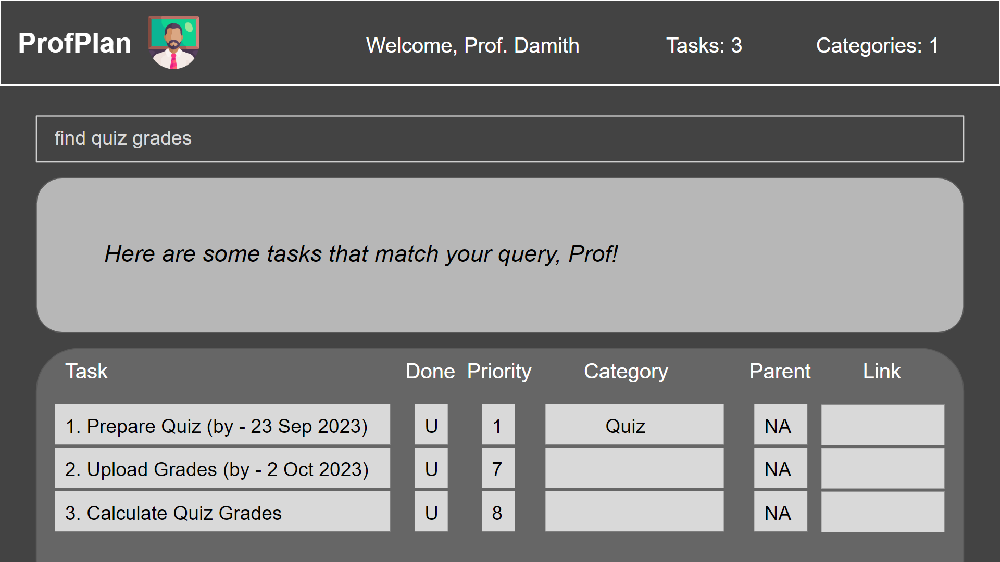

ProfPlan is a **desktop app for managing tasks, optimized for use via a Command Line Interface** (CLI) while still 
having the benefits of a Graphical User Interface (GUI). If you can type fast, ProfPlan can get your task management 
done faster than traditional GUI apps.

* Table of Contents
{:toc}

--------------------------------------------------------------------------------------------------------------------

## Quick start

1. Ensure you have Java `11` or above installed in your Computer.

1. Download the latest `profplan.jar` from [here](https://github.com/AY2324S1-CS2103T-W15-1/tp/releases).

1. Copy the file to the folder you want to use as the _home folder_ for ProfPlan.

1. Open a command terminal, `cd` into the folder you put the jar file in, and use the `java -jar profplan.jar` 
   command to run the application. 
   A GUI similar to the below should appear in a few seconds. Note how the app contains some sample data. 
   

1. Type the command in the command box and press Enter to execute it. 
   Some example commands you can try:

   * `list` : Lists all tasks.

   * `todo set finals /by 02 Nov 2023`: Adds a task titled `set finals` to the task list.

   * `delete 3` : Deletes the 3rd task shown in the current list.

   * `exit` : Exits the app.

1. Refer to the [Features](#features) below for details of each command.

--------------------------------------------------------------------------------------------------------------------

## Features

**:information_source: Notes about the command format:** 

* Words in square brackets are the parameters to be supplied by the user. 
  e.g. in `task [taskToDo] /by [deadline]`, `taskToDo` and `deadline` are parameters which can be used as `add n/John 
  Doe`.

* Items in braces are optional. 

* Items with `…` after them can accept multiple parameters. If these items are in braces, they can be used 0 times 
  as well. 
  e.g. `[keywords…]` can be used as `quiz`, `mock midterm` etc.

* Extraneous parameters for commands that do not take in parameters (such as `help`, `list`, `exit` and `clear`) will be ignored. 
  e.g. if the command specifies `help 123`, it will be interpreted as `help`.

* If you are using a PDF version of this document, be careful when copying and pasting commands that span multiple lines as space characters surrounding line-breaks may be omitted when copied over to the application.

### Locating a task: `find`

Finds tasks which have titles or descriptions that contain any of the given keywords.

Format: `find [KEYWORDS...]`

* The search is case-insensitive. e.g `Quiz` will match `quiz`
* The order of the keywords does not matter. e.g. `Canvas quiz` will match `quiz canvas`
* Only the titles and descriptions are searched.
* Only full words will be matched e.g. `Canva` will not match `Canvas`
* Persons matching at least one keyword will be returned (i.e. `OR` search).
  e.g. `midterm paper` will return `mock midterm`, `final paper`

Examples:
* `find quiz` returns `set Canvas quiz` and `Quiz TAs`
* `find grade midterm` returns `transfer grade to Canvas`, `set midterm` 
  

### Set task as parent: `set`

Sets a given task as the parent task of another given task.

Format: `set [parentTaskIndex] [childTaskIndex]`

* Both `parentTaskIndex` and `childTaskIndex` begin from 1, indexing from the current list.
* Will fail if the indices are the same, if the indices are out of bounds, or if the task at `childTaskIndex` is the 
  parent of the task at `parentTaskIndex`.

Examples:
* `set 1 4` sets the first task in the list as the parent of the fourth task in the list.
  

--------------------------------------------------------------------------------------------------------------------

## FAQ

**Q**: How do I transfer my data to another computer? 
**A**: Install the app in the other computer and overwrite the empty data file it creates with the file that 
contains the data in the previous ProfPlan home folder.

--------------------------------------------------------------------------------------------------------------------

## Known issues

1. **When using multiple screens**, if you move the application to a secondary screen, and later switch to using only the primary screen, the GUI will open off-screen. The remedy is to delete the `preferences.json` file created by the application before running the application again.

--------------------------------------------------------------------------------------------------------------------

## Command summary

| Action         | Format, Examples                                         |
|----------------|----------------------------------------------------------|
| **Find**       | `find [keywords...]`, e.g. `find canvas quiz`            |
| **Set parent** | `set [parentTaskIndex] [childTaskIndex]`, e.g. `set 1 3` |
