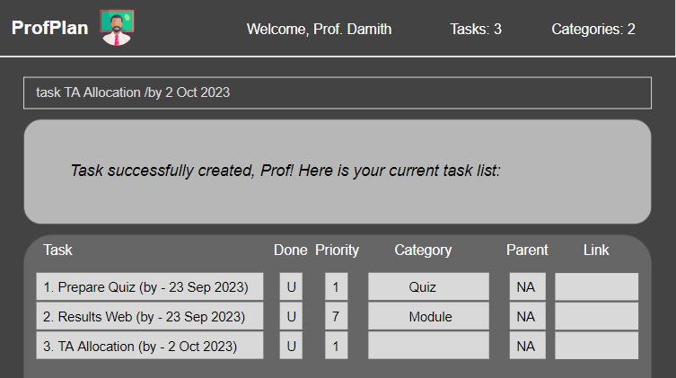
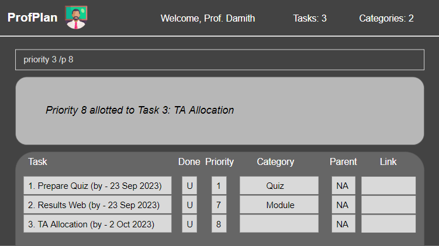
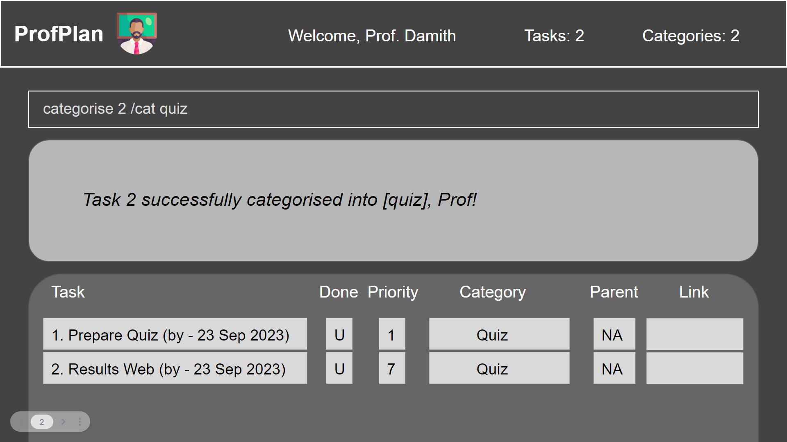
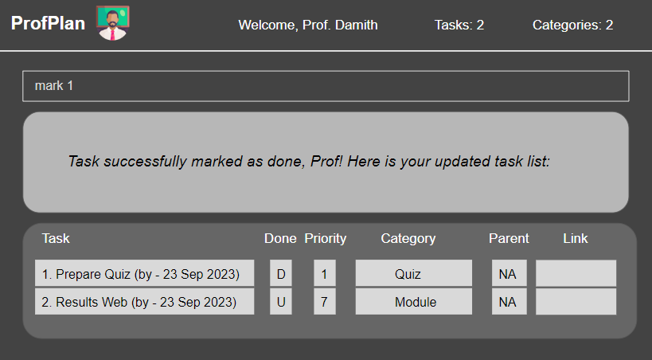
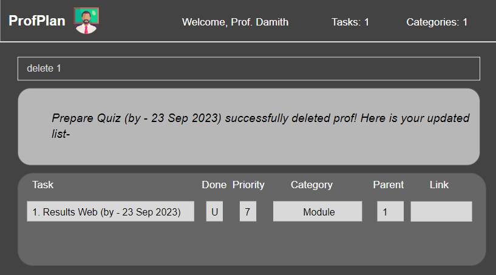
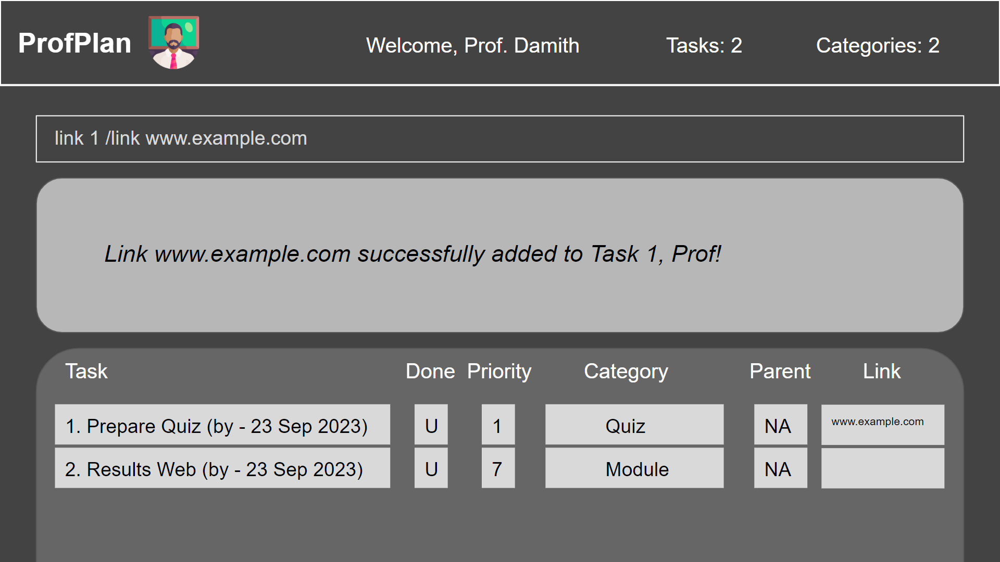
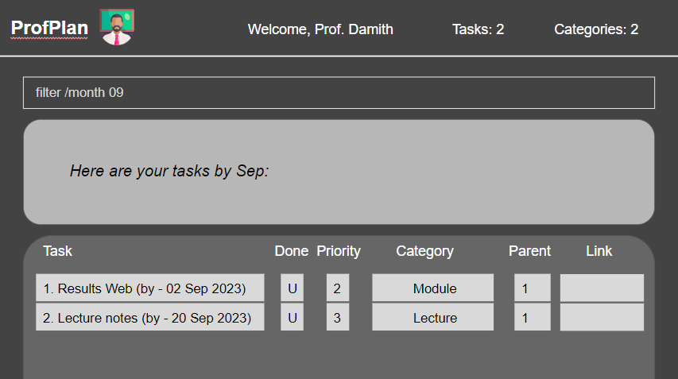
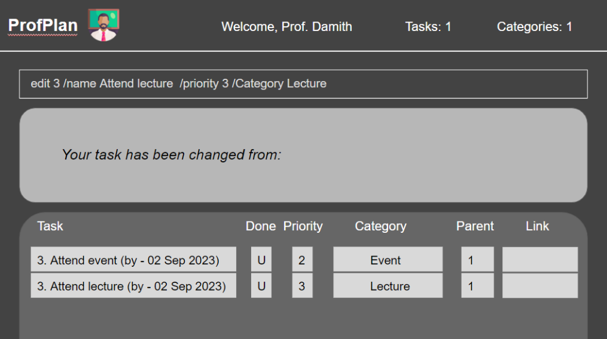

ProfPlan is a **desktop CLI app for managing tasks, optimized for use via a Command Line Interface** (CLI) while still having the benefits of a Graphical User Interface (GUI). If you can type fast, ProfPlan can get your task management done faster than traditional GUI apps.

* Table of Contents
{:toc}

--------------------------------------------------------------------------------------------------------------------

## Quick start

1. Ensure you have Java `11` or above installed in your Computer.

1. Download the latest `profplan.jar` from [here](https://github.com/AY2324S1-CS2103T-W15-1/tp/releases).

1. Copy the file to the folder you want to use as the _home folder_ for ProfPlan.

1. Open a command terminal, `cd` into the folder you put the jar file in, and use the `java -jar profplan.jar` 
   command to run the application. 

   A GUI similar to the below should appear in a few seconds. Note how the app contains some sample data. 
   

1. Type the command in the command box and press Enter to execute it. 
   Some example commands you can try:

   * `list` : Lists all tasks.

   * `todo set finals /by 02 Nov 2023`: Adds a task titled `set finals` to the task list.

   * `delete 3` : Deletes the 3rd task shown in the current list.

   * `exit` : Exits the app.

1. Refer to the [Features](#features) below for details of each command.

--------------------------------------------------------------------------------------------------------------------

## Features

**:information_source: Notes about the command format:** 

* Words in square brackets are the parameters to be supplied by the user. 
  e.g. in `task [taskToDo] /by [deadline]`, `taskToDo` and `deadline` are parameters which can be used as `add n/John 
  Doe`.

* Items in braces are optional. 

* Items with `…` after them can accept multiple parameters. If these items are in braces, they can be used 0 times 
  as well. 
  e.g. `[keywords…]` can be used as `quiz`, `mock midterm` etc.

* Extraneous parameters for commands that do not take in parameters (such as `help`, `list`, `exit` and `clear`) will be ignored. 
  e.g. if the command specifies `help 123`, it will be interpreted as `help`.

* If you are using a PDF version of this document, be careful when copying and pasting commands that span multiple lines as space characters surrounding line-breaks may be omitted when copied over to the application.

### Adding a Task : `task` [Coming Soon! Now Under Development!!]

Creates a new task and adds it to your task list. You may specify the name and deadline for the task when creating it.

Format: `task [taskToDo] /by [deadline]`

* `[taskToDo]` - String of length greater than 0, representing the task description.
* `[deadline]` - String of length greater than 0, specifying the deadline for the task.

Examples:
* `task submit quiz /by 02 Sep 2023`
* `task do homework /by 15 Oct 2023`

### Assigning Priority to a Task : `priority` [Coming Soon]

Assigns a priority level to a task ranging from 1 to 10. You may specify any integer number between 1 to 10, with 1 signifying low priority and 10 signifying higher priority.

Format: `priority [taskNumber] /p [priority]`

* `[taskNumber]` - Integer, a valid task number in the list.
* `[priority]` - Integer, ranging from 1 to 10, representing the priority level.

Examples:
* `priority 3 /p 8` assigns priority level 8 to the 3rd task.
* `priority 1 /p 5` assigns priority level 5 to the 1st task.

### Locating a task: `find`

Finds tasks which have titles or descriptions that contain any of the given keywords.

Format: `find [KEYWORDS...]`

* The search is case-insensitive. e.g `Quiz` will match `quiz`
* The order of the keywords does not matter. e.g. `Canvas quiz` will match `quiz canvas`
* Only the titles and descriptions are searched.
* Only full words will be matched e.g. `Canva` will not match `Canvas`
* Persons matching at least one keyword will be returned (i.e. `OR` search).
  e.g. `midterm paper` will return `mock midterm`, `final paper`

Examples:
* `find quiz` returns `set Canvas quiz` and `Quiz TAs`
* `find grade midterm` returns `transfer grade to Canvas`, `set midterm` 
  

### Set task as parent: `set`

Sets a given task as the parent task of another given task.

Format: `set [parentTaskIndex] [childTaskIndex]`

* Both `parentTaskIndex` and `childTaskIndex` begin from 1, indexing from the current list.
* Will fail if the indices are the same, if the indices are out of bounds, or if the task at `childTaskIndex` is the 
  parent of the task at `parentTaskIndex`.

Examples:
* `set 1 4` sets the first task in the list as the parent of the fourth task in the list.
  

### Categorising a task: `categorise`

Puts the task in a category of the task list. If the category specified does not yet exist, it will be created. 

Format: `categorise [taskNumber] /cat [category]​`

* Categorises the task at the specified [taskNumber]. The [taskNumber] refers to the [taskNumber] number shown in the displayed tasks list. The [taskNumber] must be a positive integer 1, 2, 3, … 
* [category] must be a string.

* Existing values will be updated to the input values.

Examples:
* `categorise 2 /cat quiz` Categorises the 2nd task into the `category` quiz.
  

### Mark Task as Done/Undone

The "Mark Task as Done/Undone" feature allows you to easily track the completion status of your tasks. You can mark a task as done when you have completed it, and mark it as undone if you need to revisit or revise the same task.

#### Command Format

- To mark a task as done: `mark [taskNumber]`
- To mark a task as undone: `unmark [taskNumber]`

#### Acceptable Values for Parameters

- `[taskNumber]`: An integer representing the task number in your task list (e.g. 1, 2, 3, ...)

#### Examples
- `mark 1`
- `unmark 2`

### Delete Task/Delete all Tasks

The "Delete Tasks" feature allows you to remove specific tasks from your task list when they are no longer relevant. 
You can also delete all the tasks in the list if needed.

#### Command Format

- To delete a specific task: `delete [taskNumber]`
- To delete all tasks: `delete all`

#### Example Commands

1. `delete 2` (To delete the task at index number 2)
2. `delete all` (To delete all tasks in the list)

#### Acceptable Values for Parameters

- `[taskNumber]`: An integer representing a valid task number in the list.
- `"all"`: A keyword (type string) to delete all tasks in the list.

#### Examples
- `delete 1`
- `delete all`: It will just delete all the tasks.

### Exiting the program : `exit`

Exits the program.

Format: `exit`

### Attach links or references to a task: `link`

Attach a URL or external link to the task.

Format: ` link [taskNumber] /link [URL]​`

* Attaches the specified [link] to the task at the specified [taskNumber]. The [taskNumber] refers to the [taskNumber] number shown in the displayed tasks list. The [taskNumber] must be a positive integer 1, 2, 3, … 
* [link] must be a string.
* Existing values will be updated to the input values.

Examples:
* `link 1 /link www.example.com` Attaches the link `www.example.com` to the 1st task.
  

### Filtering tasks by date: `filter`

Filters the relevant tasks by their due dates. User can input a date, after which tasks that fall before the date is displayed.

Format: `filter /[type] [date]`

* The filter will return all tasks that fall before, and in the specified month or year.
* [type] **must be a string**, and be one of the following: `month`, or `year`.
* [date] **must be a positive integer**, of the form `mm`, if [type] is `month`.
* [date] **must be a positive integer**, of the form `yyyy`, if [type] is `year`.

Examples:
* `filter /month 09`
* `filter /year 2023` 
  

### Editing a task : `edit`

Edit the aspects of selected existing task, as specified by the user.

Format: `edit [index] /[aspect] [newValue] /[aspect] [newValue]…`

* Edits the task at the specified `[index]`. The index refers to the index number shown in the displayed tasks list. The index **must be a positive integer** 1, 2, 3, …​
* [aspect] **must be a string**, and be one of the following:  `name`, `deadline`, `priority`, `category`, `parent`, or `link`.
* [newValue] **must be a string**.
* Existing values will be updated to the input values.

Examples:
*  `edit 2 /name Updated task /priority 3` Edits the task name and priority of the 2nd task, to be `Updated task` and `3` respectively.
*  `edit 4 /parent 3 /link www.google.com` Edits the parent and link of the 4th task to be `3` and `www.google.com` respectively.
    

### Saving the data

ProfPlan data are saved in the hard disk automatically after any command that changes the data. There is no need to save manually.

### Editing the data file

ProfPlan data are saved automatically as a JSON file `[JAR file location]/data/ProfPlan.json`. Advanced users are welcome to update data directly by editing that data file.

:exclamation: **Caution:**
If your changes to the data file makes its format invalid, ProfPlan will discard all data and start with an empty data file at the next run. Hence, it is recommended to take a backup of the file before editing it.

--------------------------------------------------------------------------------------------------------------------

## FAQ

**Q**: How do I transfer my data to another computer? 
**A**: Install the app in the other computer and overwrite the empty data file it creates with the file that 
contains the data in the previous ProfPlan home folder.

--------------------------------------------------------------------------------------------------------------------

## Known issues

1. **When using multiple screens**, if you move the application to a secondary screen, and later switch to using only the primary screen, the GUI will open off-screen. The remedy is to delete the `preferences.json` file created by the application before running the application again.

--------------------------------------------------------------------------------------------------------------------

## Command summary

| Action         | Format, Examples                                         |
|----------------|----------------------------------------------------------|
| **Find**       | `find [keywords...]`, e.g. `find canvas quiz`            |
| **Set parent** | `set [parentTaskIndex] [childTaskIndex]`, e.g. `set 1 3` |

